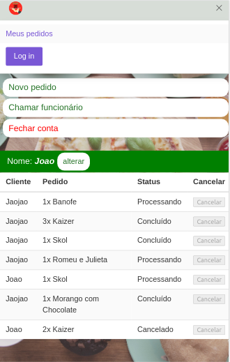
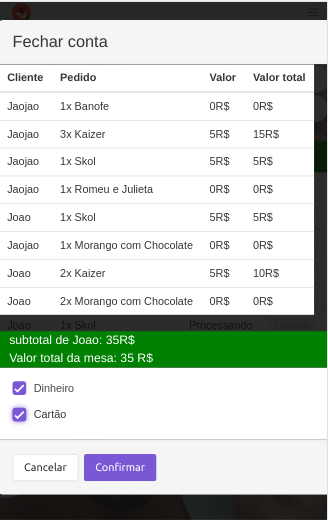
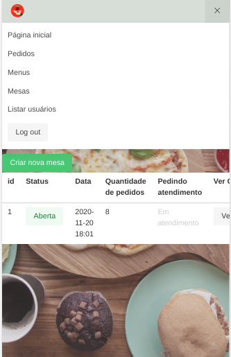
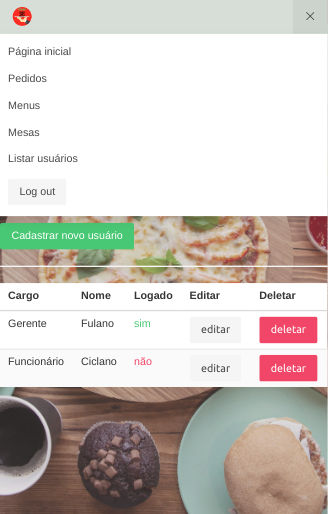

# QRodizio

**Número do Grupo**: 10 
**Código da Disciplina**: FGA0208-T01 

## Alunos

| Matrícula  | Aluno                                                           |
| ---------- | --------------------------------------------------------------- |
| 15/0078692 | [Caio César de Almeida Beleza](https://github.com/Caiocbeleza)  |
| 14/0056068 | [Cauê Mateus Oliveira](https://github.com/caue96)               |
| 12/0116928 | [Fábio Teixeira](https://github.com/fabio1079)                  |
| 14/0145842 | [João Pedro Gomes Cabral Ferreira](https://github.com/jppgomes) |
| 13/0122254 | [Lucas Midley](https://github.com/lucasmidlhey)                 |

## Sobre

O **QRodízio** é um WebApp que tem como objetivo facilitar a demanda de um restaurante. Seu principal objetivo é ter um fluxo para clientes, funcionários e gerente do restaurante tornando mais prático sem a necessidade de um aplicativo ou um cardápio físico em um restaurante.

### Como Funciona

Cliente:

- Lê-se um QRcode na mesa que o direciona para pagina do WebApp
- La é possivel fazer, atualizar ou cancelar seu pedido.
- Pode-se tambem chamar o garçom.
- Fechar a conta escolhendo forma de pagamento.

Funcionário:

- Valídar uma nova mesa
- Pode verificar pedidos e alterar para em andamento, fazendo, concluido ou cancelado
- Pode verificar os clientes que chamaram o atendimento
- Pode listar todas as mesas

Gerente:

- Tem todos os acessos de funcionário
- Pode cadastrar ou excluir um novo funcionário

## Screenshots

## Instalação

Para contribuir é necessário utilizar a virtualização do Docker  
[Guia de instalação para Linux](https://docs.docker.com/engine/install/#server) 
[Guia de instalação para Windows](https://docs.docker.com/docker-for-windows/install/) 
[Guia de instalação para Mac](https://docs.docker.com/docker-for-mac/) 

## Uso

### Back-end

Apos a instalação do **Docker** os comandos são:

- `docker-compose build`
- `docker-compose run api flask create-db`
- `docker-compose run api flask populate-all`
- `docker-compose up`

Caso necessário deletar o Banco de dados

- `docker-compose run api flask drop-db`

### Front-end

Apos a instalação do **Docker** os comandos são:

- `docker-compose build`
- `docker-compose up`

Note: Após utilizar muitas vezes `docker-compose up` recomenda-se utilizar docker-compose down`

## Vídeo

Adicione 1 ou mais vídeos com a execução do projeto final.

---

**Qualquer dúvida entre em contato com um dos mantenedores**
