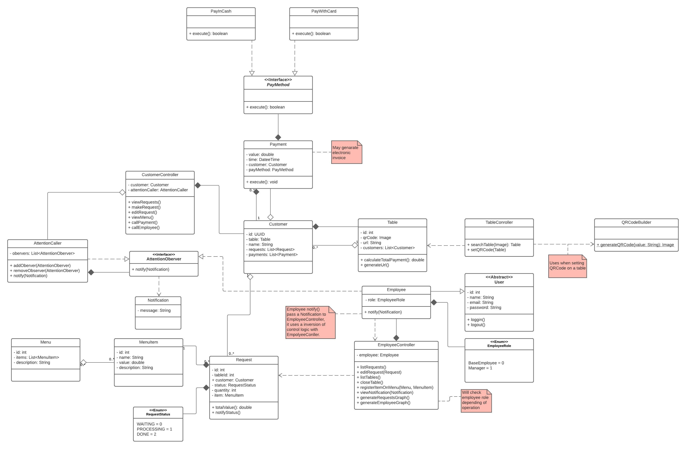

# Diagrama de classes

## Histórico de Versão

<table>
  <thead>
    <tr>
      <th>Data</th>
      <th>Autor(es)</th>
      <th>Descrição</th>
      <th>Versão</th>  
    </tr>
  </thead>

  <tbody>
    <tr>
      <td>24/09/2020</td>
      <td>
        Lucas Midlhey(<a target="blank" href="https://github.com/lucasmidlhey">Lucas Midlhey</a>),
         
        Fábio Teixeira(<a target="blank" href="https://github.com/fabio1079">fabio1079</a>)
      </td>
      <td>Criação do documento</td>
      <td>0.1</td>
    </tr>
    <tr>
      <td>25/09/2020</td>
      <td>
        Fábio Teixeira(<a target="blank" href="https://github.com/fabio1079">fabio1079</a>)
      </td>
      <td>Adiciona QRController e QRCodeBuilder</td>
      <td>0.2</td>
    </tr>
    <tr>
      <td>26/09/2020</td>
      <td>
        Fábio Teixeira(<a target="blank" href="https://github.com/fabio1079">fabio1079</a>)
      </td>
      <td>
        1 - Muda linguagem para o inglês 
        2 - Adiciona EmployeeController e CustomerController 
        3 - Muda QRController para TableConroller 
        4 - Adiciona observer design pattern para notificar funcionário quando o cliente está chamando
      </td>
      <td>0.3</td>
    </tr>
  </tbody>
</table>

## Diagrama

### Versão atual

## Versões anteriores

- [Versão 02](https://ibb.co/gP8WzxT)
- [Versão 01](https://ibb.co/5jqPWw9)
