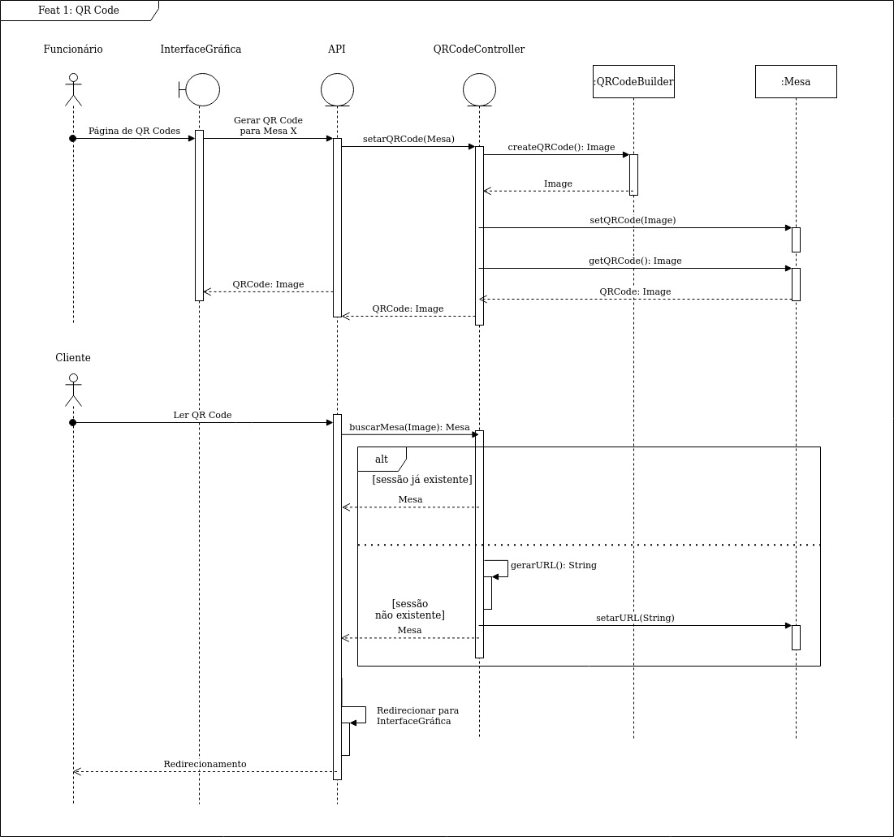

# Diagrama de sequência

## Histórico de Versão

<table>
  <thead>
    <tr>
      <th>Data</th>
      <th>Autor(es)</th>
      <th>Descrição</th>
      <th>Versão</th>  
    </tr>
  </thead>

  <tbody>
    <tr>
      <td>25/09/2020</td>
      <td>
        Fábio Teixeira(<a target="blank" href="https://github.com/fabio1079">fabio1079</a>)
      </td>
      <td>Criação do documento</td>
      <td>0.1</td>
    </tr>
  </tbody>
</table>

## Introdução

Diagramas de sequência referentes as features do [backlog](../../base/backlog_produtov2.md)

## Diagramas

### Feat 01: QR Code

