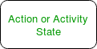
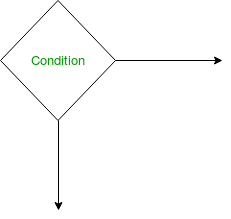
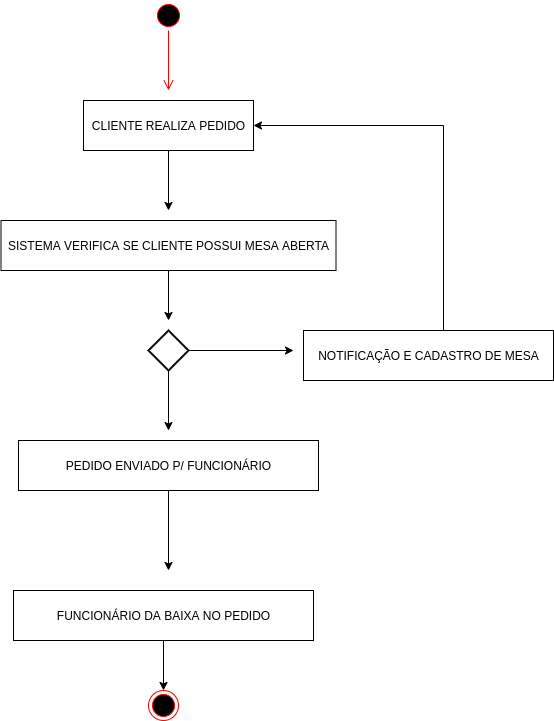

# Diagrama de Atividade

## Histórico de Versão

<table>
  <thead>
    <tr>
      <th>Data</th>
      <th>Autor(es)</th>
      <th>Descrição</th>
      <th>Versão</th>  
    </tr>
  </thead>

  <tbody>
    <tr>
      <td>16/09/2020</td>
      <td>
        Caio César Beleza(<a target="blank" href="https://github.com/Caiocbeleza">Caiocbeleza</a>)
      </td>
      <td>Adicionando Introdução de diagramas de atividade</td>
      <td>0.1</td>
    </tr>
    <tr>
      <td>16/09/2020</td>
      <td>
        Caio César Beleza(<a target="blank" href="https://github.com/Caiocbeleza">Caiocbeleza</a>)
      </td>
      <td>Adicionando diagrama de atividade cliente e funcionário</td>
      <td>0.2</td>
    </tr>
     <tr>
      <td>16/09/2020</td>
      <td>
        João Pedro Gomes(<a target="blank" href="https://github.com/jppgomes">jppgomes</a>)
      </td>
      <td>Adicionando diagrama de atividade (Realizar Pedido)</td>
      <td>0.3</td>
    </tr>
  </tbody>
</table>

## Introdução

&emsp;
Os diagramas de atividade são utilizados para ilustrar um fluxo de um sistema e mapear os passos envolvidos na execução de uma atividade, levando em consideração a sequência e as condições do fluxo da atividade.

&emsp;
Seguem as notações do diagrama de atividades:

&emsp;
Estado inicial: Onde se inicia o diagrama, antes de qualquer atividade.

&emsp;
Ação ou Atividade: Representa a execução de uma ação em algum objeto.

&emsp;
Controle de fluxo: São utilizados para demonstrar a transição de uma atividade para outra.

&emsp;
Nó de decisão: Utilizado quando existe uma condição no fluxo e se precisa escolher um dos caminhos.

&emsp;
Divisor: Utilizado para representar atividades concorrentes.

&emsp;
Junção: Junta atividades concorrentes em uma só.

&emsp;
Linhas: Agrupa atividades ou grupos relacionados em uma mesma coluna.

&emsp;
Estado Final: Marca o fim de um processo no fluxo.

&emsp;
Nós fizemos os diagramas de atividades para mapear os fluxos principais de funcionalidades que os usuários do sistema QRodízio poderão utilizar.

## Versões 1.0

### Autor: [Caio](https://github.com/Caiocbeleza)

Cliente e Funcionário

### Autor: [João Pedro Gomes](https://github.com/jppgomes)

Realizar pedido

## Referências
<ul>
<li>
GEEKSFORGEEKS. Unified Modeling Language(UML) | Activity Diagrams. Disponível em: https://www.geeksforgeeks.org/unified-modeling-language-uml-activity-diagrams/ . Acesso em: 16 de setembro. 2020.
</li>
</ul>
