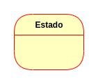
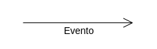
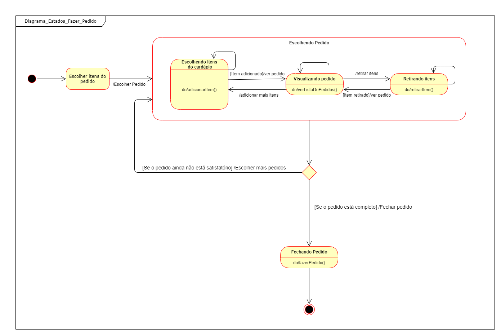

# Diagrama de Estados
## Histórico de Versão

<table>
  <thead>
    <tr>
      <th>Data</th>
      <th>Autor(es)</th>   
      <th>Descrição</th>
      <th>Versão</th>  
    </tr>
  </thead>
  <tbody>
    <tr>
      <td>17/09/2020</td>
      <td>Caio César Beleza(<a target="blank" href="https://github.com/Caiocbeleza">Caiocbeleza</a>)</td>
      <td>Adicionando Introdução de diagramas de estados</td>
      <td>
     0.1  
      </td>
    </tr>
    <tr>
      <td>17/09/2020</td>
      <td>Caio César Beleza(<a target="blank" href="https://github.com/Caiocbeleza">Caiocbeleza</a>)</td>
      <td>Adicionando diagrama de estados dos pedidos</td>
      <td>
     0.2  
      </td>
    </tr>
  </tbody>
</table>

## Introdução

&emsp;
Diagrama de estados, também conhecido como diagrama de máquina de estados, é um tipo de diagrama UML(Linguagem de Modelagem Unificada), que mostra transições entre objetos. Esse tipo de diagrama armazena os status de um objeto em um determinado momento e pode mudar de status ou causar outras ações baseado na entreda que recebe.

&emsp;
Os diagramas de estado contam com alguns elementos:
<ul>
<li>

Estado inicial: Ponto inicial, onde começa a utilização do objeto.</li>
<li>

Estado final: Ponto de saída do objeto.</li>

<li>

Estado: Representa um dos possíveis estados que um objeto pode ter.</li>

<li>

Evento ou Transição: Representa uma ação externa sobre um objeto.</li>
</ul>

&emsp;
Utilizamos os diagramas de estados para mostrar as transições de estados dos fluxos principais da aplicação.

## Versões 1.0

### Autor: [Caio](https://github.com/Caiocbeleza)

## Referências
<ul>
<li>LUCIDCHART.
O que é um diagrama de máquina de estados?. Disponível em: https://www.lucidchart.com/pages/pt/o-que-e-diagrama-de-maquina-de-estados-uml . Acesso em: 17 de setembro. 2020. </li>
<li></li>
</ul>
