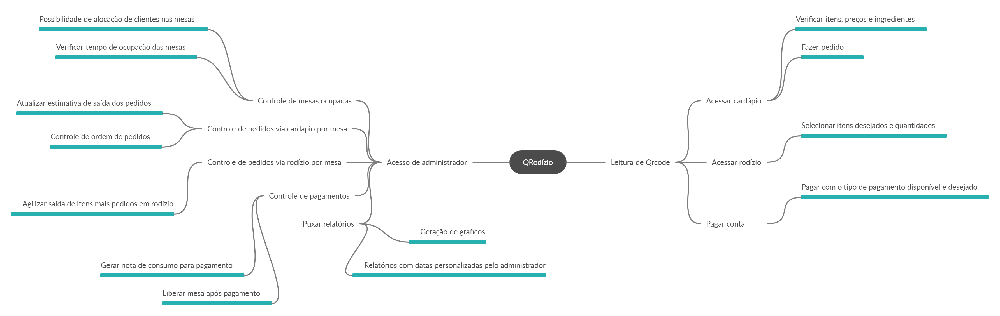

# Mapa mental

Mapa mental é uma ferramenta que auxilia na sistematização e na visualização das relações e conexões entre ideias e conceitos. E por isso é muito útil para a transmissão de conhecimentos, dados e informações. 
A idéia de um mapa mental é focalizar as ideias centrais e mostrar as relações entre essas ideias e os aspectos secundários, que também tem sua importância na construção geral do tema proposto. Em sua construção, é comum a utilização de imagens, cores e pouco texto, com frases objetivas e sucintas. 

Nós utilizamos os mapas mentais para termos um apanhado geral de quais funcionalidades cada membro do grupo acha que seriam interessantes no sistema e, com isso, definir e organizar o escopo do projeto.

## Histórico de Revisões

<table>
  <thead>
    <tr>
      <th>Data</th>
      <th>Versão</th>
      <th>Descrição</th>
      <th>Autor(es)</th>
    </tr>
  </thead>

  <tbody>
    <tr>
      <td>05/09/2020</td>
      <td>0.1</td>
      <td>Adicionando um tópico do Mapa Mental</td>
      <td>
        Cauê Mateus Oliveira(<a target="blank" href="https://github.com/caue96">Cauê</a>)
      </td>
    </tr>
    <tr>
      <td>05/09/2020</td>
      <td>0.2</td>
      <td>Adicionando Mapa Mental aluno Fábio Teixeira</td>
      <td>
        Fábio Teixeira(<a target="blank" href="https://github.com/fabio1079">fabio1079</a>)
      </td>
    </tr>
    </tr>
    <tr>
      <td>05/09/2020</td>
      <td>0.3</td>
      <td>Adicionando Mapa Mental do aluno Caio César Beleza</td>
      <td>
        Caio César Beleza(<a target="blank" href="https://github.com/Caiocbeleza">Caiocbeleza</a>)
      </td>
    </tr>
    <tr>
      <td>06/09/2020</td>
      <td>0.4</td>
      <td>Adicionando Mapa Mental do Grupo</td>
      <td>
        Caio César Beleza(<a target="blank" href="https://github.com/Caiocbeleza">Caiocbeleza</a>)
      </td>
    </tr>
    <tr>
      <td>06/09/2020</td>
      <td>0.5</td>
      <td>Adicionando Introdução de Mapa Mental </td>
      <td>
        Caio César Beleza(<a target="blank" href="https://github.com/Caiocbeleza">Caiocbeleza</a>)
      </td>
    </tr>
  </tbody>

</table>

## Visões individuais

### Autor: Cauê

### Autor: Fábio

### Autor: Caio

## Visão final do grupo

## Referências
<ul>
  <li>LCM TREINAMENTO. Mapa mental: pra que serve?. Disponível em https://lcmtreinamento.com.br/mapa-mental-para-que-serve/ . Acesso em: 06 set. 2020</li>
</ul>
