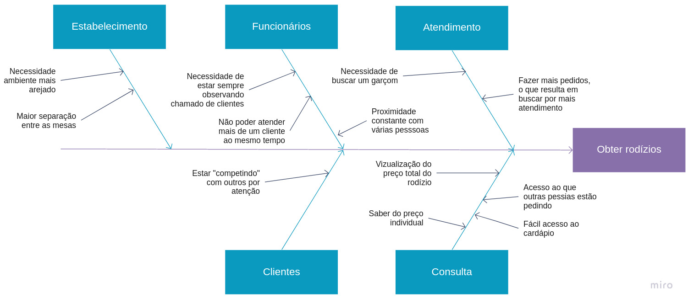
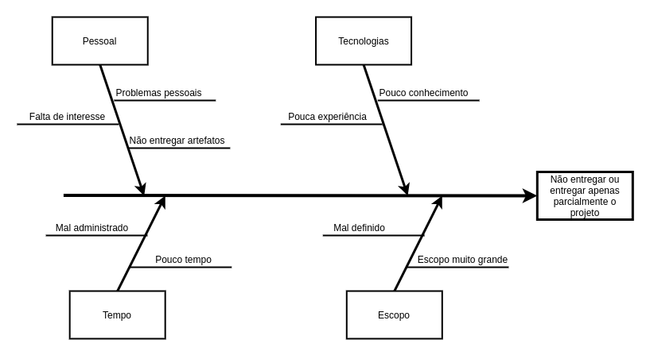
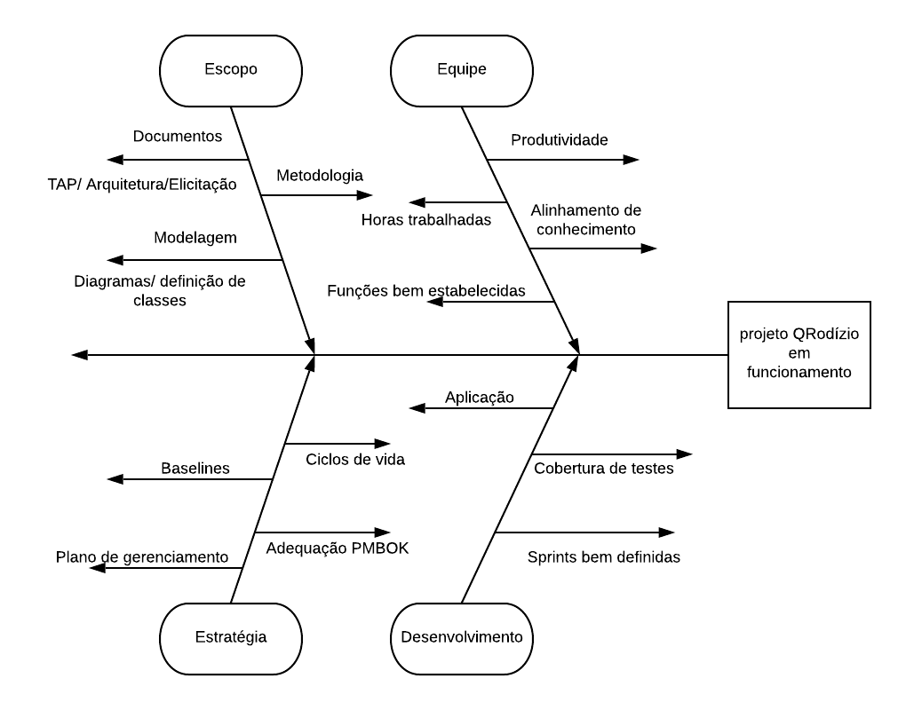

# Diagrama Ishikawa

## Histórico de revisao
|Data|Autor(es)|Descrição|Versão|
|----|----|----|----|
|05/09/2020|Cauê Mateus Oliveira(<a target="blank" href="https://github.com/caue96">Cauê Mateus Oliveira</a>)|Adicionando um tópico do Diagrama Ishikawa|0.1|
|05/09/2020|Fábio Teixeira(<a target="blank" href="https://github.com/fabio1079">Fabio Teixeira</a>)|Adicionando Diagrama Ishikawa Fábio|0.2|
|05/09/2020|Caio César Beleza(<a target="blank" href="https://github.com/Caiocbeleza">Caiocbeleza</a>)|Adicionando Versão 1 Diagrama Ishikawa geral do projeto|0.3|
|08/09/2020|Lucas Midlhey(<a target="blank" href="https://github.com/lucasmidlhey">Lucas Midlhey</a>)|Adicionando Versão 1 Diagrama Ishikawa |0.4|
---

## Visões individuais
### Autor: Cauê

### Autor: Fábio

### Autor: Caio

### Autor: Lucas

---

## Visão final do grupo

---
