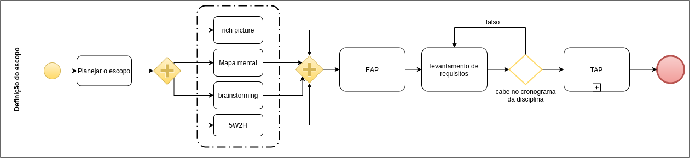
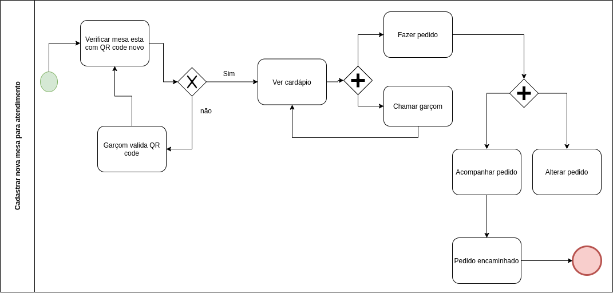
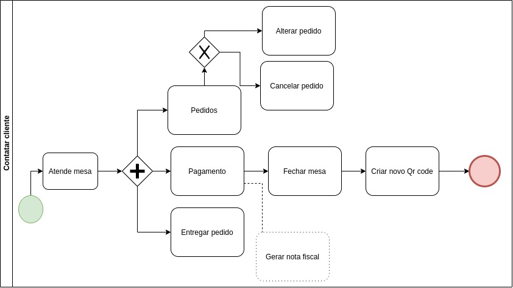

# Modelagem BPMN

## Histórico de versão

<table>
  <thead>
    <tr>
      <th>Data</th>
           <th>Autor(es)</th>
      <th>Descrição</th>
      <th>Versão</th>
    </tr>
  </thead>
  <tbody>
    <tr>
      <td>09/09/2020</td>
      <td>Caio César Beleza(<a target="blank" href="https://github.com/Caiocbeleza">Caiocbeleza</a>)</td>
      <td>Adicionando Introdução de Modelagem BPMN</td>
      <td>
        0.1
      </td>
    </tr>
    <tr>
      <td>10/09/2020</td>
      <td>Caio César Beleza(<a target="blank" href="https://github.com/Caiocbeleza">Caiocbeleza</a>)</td>
      <td>Adicionando Diagrama BPMN da escolha do tema</td>
      <td>
        0.2
      </td>
    </tr>
    <tr>
      <td>10/09/2020</td>
      <td>Caio César Beleza(<a target="blank" href="https://github.com/Caiocbeleza">Caiocbeleza</a>)</td>
      <td>Adicionando Diagrama BPMN de Sprint Planning</td>
      <td>
        0.3
      </td>
    </tr>
    <tr>
      <td>10/09/2020</td>
      <td>Caio César Beleza(<a target="blank" href="https://github.com/Caiocbeleza">Caiocbeleza</a>)</td>
      <td>Adicionando Diagrama BPMN de Sprint Review</td>
      <td>
        0.4
      </td>
    </tr>
    <tr>
      <td>10/09/2020</td>
      <td>Lucas Midlhey<a target="blank" href="https://github.com/lucasmidlhey">(lucasmidlhey</a>)</td>
      <td>Adicionando Diagrama BPMN escopo e metodologia</td>
      <td>
        0.5
      </td>
    </tr>
    <tr>
      <td>10/09/2020</td>
      <td>Joao Pedro<a target="blank" href="https://github.com/jppgomes">(jppgomes</a>)</td>
      <td>Adicionando Diagrama BPMN cadastro de mesa</td>
      <td>
        0.6
      </td>
    </tr>
    <tr>
      <td>11/09/2020</td>
      <td>Cauê Mateus Oliveira<a target="blank" href="https://github.com/caue96">(caue96</a>)</td>
      <td>Adicionando Diagrama BPMN processo geral e justificativa das modelagens</td>
      <td>
        0.7
      </td>
    </tr>
    <tr>
      <td>02/10/2020</td>
      <td>Lucas Midlhey<a target="blank" href="https://github.com/lucasmidlhey">(lucasmidlhey</a>) e Joao Pedro<a target="blank" href="https://github.com/jppgomes">(jppgomes</a>)</td>
      <td>Adiconando diagrama Abrir nova mesa para atendimento</td>
      <td>
        1.0
      </td>
    </tr>
  </tbody>
</table>

## Introdução

&emsp;
BPMN(Business Process Model and Notation) é uma notação que permite uma ilustração de processos, especificando-os em diagramas que sejam fácies de ler. Isso é feito através da simbologia BPMN, que serve como uma linguagem padrão para essa notação.

&emsp;
O que a linguagem BPMN faz é representar cada ação como um símbolo. São utilizado quatro tipos de símbolo: 
<ul>
<li>Objetos de fluxo;</li>
<li> Objetos de conexão;</li>
<li> Swim Lanes;</li>
<li>Artefatos.</li>  
</ul>

&emsp;
Existem 3 tipos de objetos de fluxo:
<ul>
<li>Atividades: Que representão os trabalhos a serem feitos(sempre são ações), simbolizados por quadrados</li>
<li>Eventos: Que simbolizam ocorrências no processo, simbolizados por círculos</li>
<li>Gateways: Pontos Condicionais, que determinam o para qual direção o processo irá seguir, simbolizados por diamantes</li>
</ul>

&emsp;
Os tipos de swim lanes são 2:
<ul>
<li>Piscinas(Pools): São os processos contidos em um processo</li>
<li>Raias(Lanes): Cada piscina possui raias, que simbolizam papéis, áreas e responsabilidades no processo.</li>
</ul>

&emsp;
Os seguintes são fluxos de conexão:
<ul>
<li>Fluxo de sequência: Que mostra a ordem das atividades, simbolizadas por uma linha preta cheia com uma seta</li>
<li>Fluxo de mensagens: Indica mensagens entre processos/piscinas, simbolizado por uma linha tracejada, com um círculo aberto numa extremidade e uma seta aberta na outra.</li>
<li>Associação: Conceta os artefatos aos objetos de fluxo, simbolizado por uma linha tracejada.</li>
</ul>

&emsp;
Artefatos são os objetos de dados, que podem ser saída, entrada, armazenamento de dados e objetos de dados.

&emsp;
Nós utilizaremos a modelagem BPMN para conseguirmos mapear, de forma que seja de fácil entendimento para todos, os fluxos dos processos que serão implementados durante o projeto.

## Justificativa Modelagem

&emsp;
Para se inserir princípios da metodologia ágil que utilizaremos em nosso projeto nos modelelos com notação BPMN, as modelagens feitas devem ser modeladas em pequenas partes para que não fique poluído a visualização de mesma. (KOLAR e PITNER, 2013; THIEMICH e PUHLMANN, 2013) Não abordam como a modelagem deve ser feita exatamente para se inserir a metodologia ágil, porém eles sugerem modelar em pequenos processos para que a visualização fique lúcida.

## Versões 1.0

### Processo Geral

### Autor: [Cauê](https://github.com/caue96)

### Processo de Escolha do Tema do Projeto

### Autor: [Caio](https://github.com/Caiocbeleza)

### Definição de metodologia

### Autor: [Lucas](https://github.com/lucasmidlhey)

### Processo de Sprint Planning

### Autor: [Caio](https://github.com/Caiocbeleza)

### Processo de Sprint Review

### Autor: [Caio](https://github.com/Caiocbeleza)

### Definição de escopo

### Autor: [Lucas](https://github.com/lucasmidlhey)

### Definição de Cadastro de Mesa

### Autor: [Joao Pedro](https://github.com/jppgomes)

### Abrir nova mesa para atendimento

### Autores: [Joao Pedro](https://github.com/jppgomes) e [Lucas](https://github.com/lucasmidlhey)

### Contatar cliente

### Autores: [Joao Pedro](https://github.com/jppgomes) e [Lucas](https://github.com/lucasmidlhey)

## Referências

HEFLO. Notação BPMN, a mais usada para modelar processos. Disponível em https://www.heflo.com/pt-br/bpm/notacao-bpmn/ . Acesso em: 09 de setembro. 2020.

KOLAR, J.; PITNER, T., 2013, [“Agile BPM in the age of Cloud technologies“](https://www.scpe.org/index.php/scpe/article/view/810), Scalable Computing: Practice and Experience, v. 13, n. 4 (Jan.)

THIEMICH, C.; PUHLMANN, F., 2013, [“An Agile BPM Project Methodology“](https://link.springer.com/chapter/10.1007/978-3-642-40176-3_25), In: Daniel, F., Wang, J., Weber, B. (eds), Business Process Management,  Springer Berlin Heidelberg, pp. 291–306.
