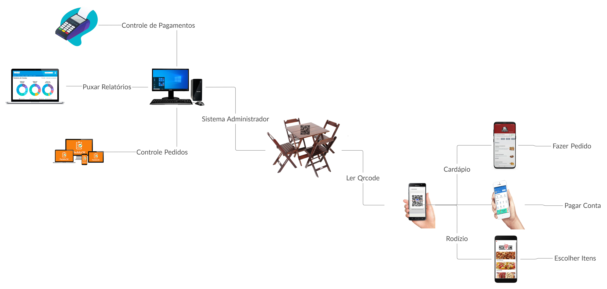
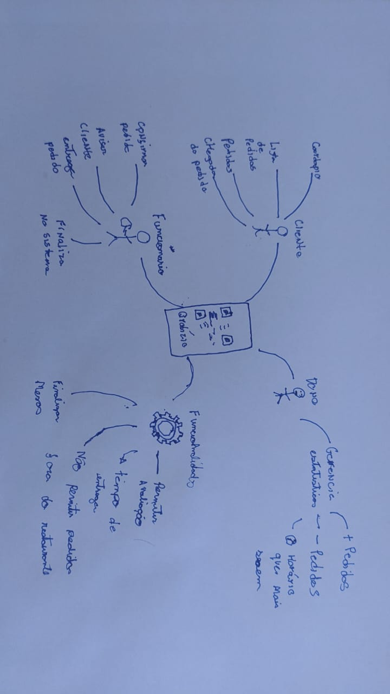
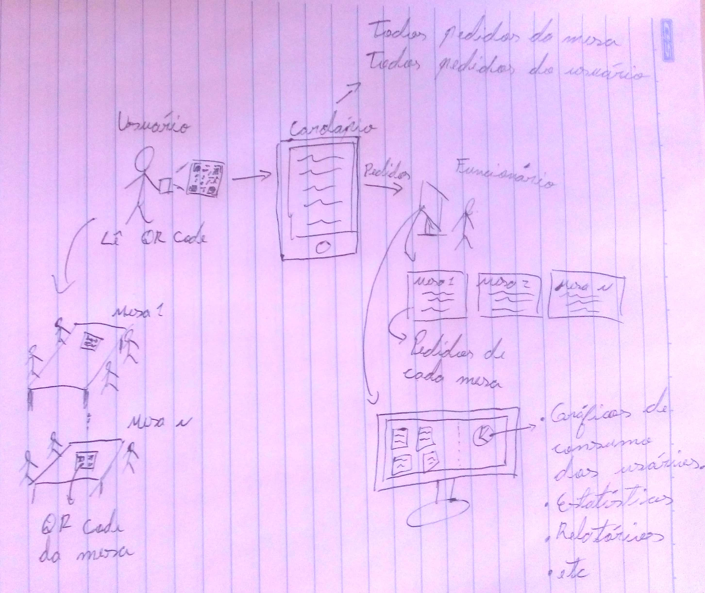

# Rich Picture
## Histórico de versão

<table>
  <thead>
    <tr>
      <th>Data</th>
      <th>Versão</th>
      <th>Descrição</th>
      <th>Autor(es)</th>
    </tr>
  </thead>
  <tbody>
    <tr>
      <td>02/09/2020</td>
      <td>Caio César Beleza(<a target="blank" href="https://github.com/Caiocbeleza">Caiocbeleza</a>)</td>
      <td>Adicionando introdução de Rich Picture</td>
      <td>
        0.1
      </td>
    </tr>
    <tr>
      <td>05/09/2020</td>
      <td> Cauê Mateus Oliveira(<a target="blank" href="https://github.com/caue96">caue96</a>)</td>
      <td>Adicionando um tópico do Rich Picture</td>
      <td>
       0.2
      </td>
    </tr>
    <tr>
      <td>05/09/2020</td>
      <td>Fábio Teixeira(<a target="blank" href="https://github.com/fabio1079">fabio1079</a>)</td>
      <td>Adicionando Rich Picture do aluno Fábio Teixira</td>
      <td>
      0.3  
      </td>
    </tr>
    <tr>
      <td>05/09/2020</td>
      <td>Caio César Beleza(<a target="blank" href="https://github.com/Caiocbeleza">Caiocbeleza</a>)</td>
      <td>Adicionando Rich Picture versão 1 do cliente do aluno Caio César Beleza</td>
      <td>
        0.4
      </td>
    </tr>
    <tr>
      <td>05/09/2020</td>
      <td> Caio César Beleza(<a target="blank" href="https://github.com/Caiocbeleza">Caiocbeleza</a>)</td>
      <td>Adicionando Rich Picture versão 1 do gerente do aluno Caio César Beleza</td>
      <td>
       0.5
      </td>
    </tr>
        <tr>
      <td>08/09/2020</td>
      <td>Lucas Midlhey(<a target="blank" href="https://github.com/lucasmidlhey">lucasmidlhey</a>)</td>
      <td>Adicionando Rich Picture versao 1 geral do aluno Lucas Midlhey</td>
      <td>
       0.6
      </td>
    </tr>
  </tbody>
</table>

## Introdução

Rich Picture é uma técnica de representação de informações através do pensamento visual e tem o propósito de expressar de modo sistêmico cenários e situações-problema onde não se tem uma solução única, já que esta técnica pode ilustrar vários pontos de vista diferentes. 
Esta metodologia é utilizada em questões onde os problemas e suas respectivas soluções não estão totalmente estruturadas e onde as fronteiras dos sistemas não estão claramente definidas(TOLFO, 2020).

 No Projeto QRodízio, os rich pictures foram utilizados na fase inicial para conceituar uma visão geral do projeto, trazendo um auxílio visual, para que os integrantes da equipe pudessem mostrar suas ideias de como seria o projeto, de uma forma que fosse de fácil entendimento para todos.

## Visões individuais

### Autor: Cauê

### Autor: Lucas

### Autor: Fábio

### Autor: Caio

Versão do cliente

### Autor: Caio

Versão do gerente

### Autor: João Pedro

Versão do gerente

---

## Visão final do grupo

## Referências
<ul>
  <li>TOLFO, Cristiano. O uso de rich picture como recurso didático baseado no pensamento visual. Research, Society and Development, v. 9, n. 1, p. e79911663-e79911663, 2020.</li>
</ul>
