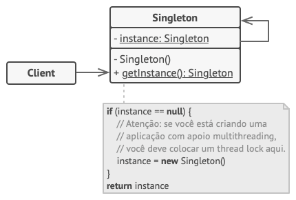

## Singleton

## Histórico de Versão

<table>
  <thead>
    <tr>
      <th>Data</th>
      <th>Autor(es)</th>
      <th>Descrição</th>
      <th>Versão</th>
    </tr>
  </thead>

  <tbody>
    <tr>
      <td>26/10/2020</td>
      <td>
        Fábio Teixeira(<a target="blank" href="https://github.com/fabio1079">fabio1079</a>)
      </td>
      <td>Adicionando utilização do singleton no projeto</td>
      <td>0.1</td>
    </tr>
  </tbody>
</table>

## Introdução

<p align="justify">&emsp;
O Singleton é um padrão de projeto criacional que permite a você garantir que uma classe tenha apenas uma instância, enquanto provê um ponto de acesso global para essa instância.
</p>

## Estrutura



## Aplicações no Projeto(QRodízio)

### Disclaimer
Primeiramente é bom deixar claro que nosso projeto está utilizando de linguagens multi-paradigmas(python e javascript) sendo assim, adaptações ao padões são necessárias para não fugir do esttilo do código utilizado pelo linguegem.

A Linguem python possui em seu "zen of python" a seguinte declaração: "Simple is better than complex". Seguindo a filosifia do "zen of python" **decidimos que, se algo pode ser feito em uma função, então será feito em uma função**.

### Utilização
Em nossa base de código o padrão singleton está previsto para ser utilizado mas nao está implementado no momento. Isto se deve ao fato de que ele será utilizado para manter um poll de funcionários logados para notificá-los. Porém, toda a parte de notificações(que irá utilizar bastante do observer) está prevista para a próxima sprint e ficou fora dessa release. 

Segue um exemplo de como o padrão singleton poderá ser utilizado na próxima sprint:

### Exemplo 1, o mais simples possível
```python
_logged_employees_pool = []

def add_employee(employee):
    global _logged_employees_pool
    _logged_employees_pool.append(employee)

def get_employees():
    global _logged_employees_pool
    return _logged_employees_pool
```

### Exemplo 2, java like
```python
class SingletonMeta(type):
    _instances = {}

    def __call__(cls, *args, **kwargs):
        if cls not in cls._instances:
            instance = super().__call__(*args, **kwargs)
            cls._instances[cls] = instance
        return cls._instances[cls]


class LoggedEmployeesPoolSingleton(metaclass=SingletonMeta):
    def __init__(self):
        self._logged_employees = []
    
    def add_employee(self, employee):
        self._logged_employees.append(employee)

    def get_employees(self):
        return self._logged_employees
```

## Referências
<ul>
<li>
REFACTORING.GURU. Strategy. Disponível em: https://refactoring.guru/pt-br/design-patterns/singleton . Acesso em: 26 de outubro. 2020.
</li>
</ul>
