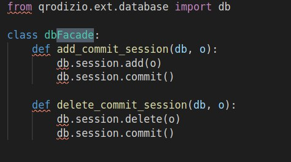

## Observer

## Histórico de Versão

<table>
  <thead>
    <tr>
      <th>Data</th>
      <th>Autor(es)</th>
      <th>Descrição</th>
      <th>Versão</th>
    </tr>
  </thead>
  <tbody>
    <tr>
      <td>19/11/2020</td>
      <td>
       João Pedro(<a target="blank" href="https://github.com/jppgomes">jppgomes</a>)
      </td>
      <td>Adicionando utilização do observer no projeto</td>
      <td>0.1</td>
    </tr>
  </tbody>
</table>

## Introdução

&emsp;
O principal objetivo de um Façade é facilitar o uso de um ou mais componentes de software. Isso é realizado por meio da construção de uma “fachada” que isola a aplicação cliente de toda a complexidade de um subsistema. O padrão Façade define uma interface de alto-nível que simplifica as chamadas a subsistemas complexos.

&emsp;
Basicamente, o padrão Façade propõe uma forma mais simples de interagir com o sistema que o modelo atual oferece. Claro, por ser mais simples, esta abordagem funciona quando o cliente precisa utilizar apenas um subconjunto dos recursos oferecidos pelo subsistema e/ou adaptá-lo para uso de uma maneira particular em suas necessidades.

## Estrutura

## Aplicações no Projeto(QRodízio)

### Disclaimer

Primeiramente é bom deixar claro que nosso projeto está utilizando de linguagens multi-paradigmas(python e javascript) sendo assim, adaptações aos padrões são necessárias para não fugir do estilo do código utilizado.

A Linguem python possui em seu "zen of python" a seguinte declaração: "Simple is better than complex". Seguindo a filosifia do "zen of python" **decidimos que, se algo pode ser feito em uma função, então será feito em uma função**.

### Utilização

Em nossa base de código o padrão facade é utilizado para realizar operações e commit no banco de dado
postgree.

Exemplo código:

## Aplicabilidade

- Utilize o padrão Observer quando mudanças no estado de um objeto podem precisar mudar outros objetos, e o atual conjunto de objetos é desconhecido de antemão ou muda dinamicamente.
- O padrão Observer permite que qualquer objeto que implemente a interface do assinante possa se inscrever para notificações de eventos em objetos da publicadora. Você pode adicionar o mecanismo de inscrição em seus botões, permitindo que o cliente coloque seu próprio código através de classes assinantes customizadas.
- Utilize o padrão quando alguns objetos em sua aplicação devem observar outros, mas apenas por um tempo limitado ou em casos específicos.

## Referências

<ul>
<li>
REFACTORING.GURU. Strategy. Disponível em: https://refactoring.guru/pt-br/design-patterns/observer . Acesso em: 26 de outubro. 2020.
</li>
</ul>
