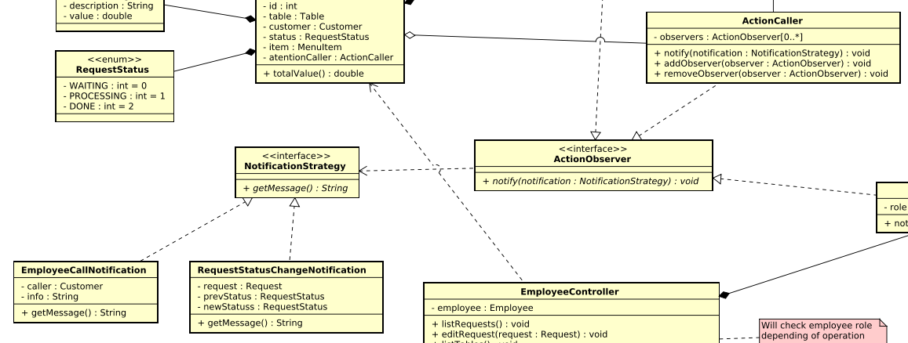

## Observer

## Histórico de Versão

<table>
  <thead>
    <tr>
      <th>Data</th>
      <th>Autor(es)</th>
      <th>Descrição</th>
      <th>Versão</th>
    </tr>
  </thead>
  <tbody>
    <tr>
      <td>26/10/2020</td>
      <td>
        Fábio Teixeira(<a target="blank" href="https://github.com/fabio1079">fabio1079</a>)
      </td>
      <td>Adicionando utilização do observer no projeto</td>
      <td>0.1</td>
    </tr>
    <tr>
      <td>26/10/2020</td>
      <td>
        Lucas Midlhey(<a target="blank" href="https://github.com/lucasmidlhey">lucasmidlhey</a>)
      </td>
      <td>Adicionando referencia e aplicabilidade</td>
      <td>0.2</td>
    </tr>
    <tr>
      <td>26/10/2020</td>
      <td>
        Cauê(<a target="blank" href="https://github.com/caue96">caue96</a>)
      </td>
      <td>Incrementando a introdução do que é o padrão observer</td>
      <td>0.3</td>
    </tr>
  </tbody>
</table>

## Introdução

&emsp;
O Observer é um padrão de projeto comportamental que permite definir um mecanismo de assinatura para notificar múltiplos objetos sobre quaisquer eventos que aconteçam com o objeto que eles estão observando.

&emsp;
O padrão Observer sugere que seja adicionado um mecanismo de assinatura para a classe que notifica outros objetos sobre as mudanças em seu estado, para que objetos individuais possam assinar ou desassinar uma corrente de eventos vindo dessa classe. Esse mecanismo consiste em 2 estapas: 1 - Um vetor para armazenar uma lista de referências aos objetos que querem saber das mudanças do estado da classe notificadora; 2 - Alguns métodos públicos que permitem adicionar os objetos que querem saber das mudanças do estado da classe notificadora e removê-los da lista.

## Estrutura

## Aplicações no Projeto(QRodízio)

### Disclaimer

Primeiramente é bom deixar claro que nosso projeto está utilizando de linguagens multi-paradigmas(python e javascript) sendo assim, adaptações aos padrões são necessárias para não fugir do estilo do código utilizado.

A Linguem python possui em seu "zen of python" a seguinte declaração: "Simple is better than complex". Seguindo a filosifia do "zen of python" **decidimos que, se algo pode ser feito em uma função, então será feito em uma função**.

### Utilização

Em nossa base de código o padrão observer está previsto para ser utilizado mas nao está implementado no momento. Isto se deve ao fato de que ele será utilizado em todo o sistema de notificações(notificar funcionários de pedidos, notificar mesa de status dos pedidos, etc). Porém, toda a parte de notificações está prevista para a próxima sprint e ficou fora dessa release.

Toda a parte de notificações está modelada no [diagrama de classes](http://localhost:8080/2020.1_G10_QRodizio/modelagem/diagramas_estaticos/diagrama_classes.html#historico-de-versao) do projeto.

Segue um recorte do diagrama de classes com a utilização do padrão observer

Basicamente será utilizado um strategy(NotificationStrategy) para definir como será a mensagem da notificação.

## Aplicabilidade

- Utilize o padrão Observer quando mudanças no estado de um objeto podem precisar mudar outros objetos, e o atual conjunto de objetos é desconhecido de antemão ou muda dinamicamente.
- O padrão Observer permite que qualquer objeto que implemente a interface do assinante possa se inscrever para notificações de eventos em objetos da publicadora. Você pode adicionar o mecanismo de inscrição em seus botões, permitindo que o cliente coloque seu próprio código através de classes assinantes customizadas.
- Utilize o padrão quando alguns objetos em sua aplicação devem observar outros, mas apenas por um tempo limitado ou em casos específicos.

## Referências

<ul>
<li>
REFACTORING.GURU. Strategy. Disponível em: https://refactoring.guru/pt-br/design-patterns/observer . Acesso em: 26 de outubro. 2020.
</li>
</ul>
