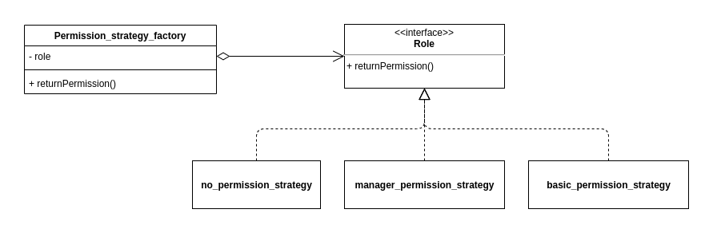

## Strategy
## Histórico de Versão

<table>
  <thead>
    <tr>
      <th>Data</th>
      <th>Autor(es)</th>
      <th>Descrição</th>
      <th>Versão</th>
    </tr>
  </thead>

  <tbody>
    <tr>
      <td>13/10/2020</td>
      <td>
        Caio César Beleza(<a target="blank" href="https://github.com/Caiocbeleza">Caiocbeleza</a>)
      </td>
      <td>Adicionando introdução do padrão strategy </td>
      <td>0.1</td>
    </tr>
    <tr>
      <td>13/10/2020</td>
      <td>
        Caio César Beleza(<a target="blank" href="https://github.com/Caiocbeleza">Caiocbeleza</a>)
      </td>
      <td>Adicionando estrutura do padrão strategy </td>
      <td>0.2</td>
    </tr>
    <tr>
      <td>13/10/2020</td>
      <td>
        Caio César Beleza(<a target="blank" href="https://github.com/Caiocbeleza">Caiocbeleza</a>)
      </td>
      <td>Adicionando trecho de código do projeto com padrão strategy </td>
      <td>0.3</td>
    </tr>
    <tr>
      <td>20/10/2020</td>
      <td>
        Caio César Beleza(<a target="blank" href="https://github.com/Caiocbeleza">Caiocbeleza</a>)
      </td>
      <td>Adicionando explicação da aplicação do padrão strategy no projeto e as facilidades que esse padrão oferece.</td>
      <td>0.4</td>
    </tr>
    <tr>
      <td>26/10/2020</td>
      <td>
        Caio César Beleza(<a target="blank" href="https://github.com/Caiocbeleza">Caiocbeleza</a>)
      </td>
      <td>Adicionando modelagem strategy.</td>
      <td>0.5</td>
    </tr>
  </tbody>
</table>

## Introdução

<p align="justify">&emsp;
O Strategy é um padrão comportamental que permite definir uma família de algorítmos, colocá-los em classes separadas e fazer com que seus objetos sejam permutáveis.
</p>
<p align="justify">&emsp;
Este padrão sugere que você pegue uma classe que faz algo específico em diversas maneiras diferentes e extraia todos esses algoritmos para classes separadas chamadas strategy.
</p>

## Estrutura


<p align="justify">&emsp;
- "Context" mantém uma referência para uma "ConcreteStrategy" e se comunica com esse objeto através da interface "Strategy".
</p>
<p align="justify">&emsp;
- A interface "Strategy" é comum à todas "ConcreteStrategy". Ela declara um método uqe o "Context" usa para executar uma "Strategy"
</p>
<p align="justify">&emsp;
- As "ConcreteStrategy" implementam diferentes variações de um algoritmo que o "Context" usa.
</p>
<p align="justify">&emsp;
- O "Context" chama o método de execução no objeto "Strategy" ligado cada vez que ele precisa rodar um algorítmo. O "Context" não sabe qual tipo de "Strategy" ele está trabalhando ou como o algoritmo é executado.
</p>
<p align="justify">&emsp;
- O "Client" cria um objeto "Strategy" específico e passa ele para "Context". O "Context" expõe um setter que permite o "Client" mudar o "Strategy" associada com o "Context" durante a execução.
</p>


## Aplicações no Projeto(QRodízio)

### Disclaimer
Primeiramente é bom deixar claro que nosso projeto está utilizando de linguagens multi-paradigmas(python e javascript) sendo assim, adaptações aos padrões são necessárias para não fugir do estilo do código utilizado.

A Linguem python possui em seu "zen of python" a seguinte declaração: "Simple is better than complex". Seguindo essa filosifia, decidimos que, se algo pode ser feito em uma função, então será feito em uma função. Assim mantendo um código mais limpo, simples e fácil de manter.

### Trecho do código

```python
def permission_strategy_factory(role):
    """Given a role, returns a permission strategy for that role"""
    if role == EmployeeRole.basic:
        return basic_permission_strategy
    elif role == EmployeeRole.manager:
        return manager_permission_strategy
    else:
        return no_permission_strategy


def no_permission_strategy(*args, **kwargs):
    """No permission at all"""
    return False


def manager_permission_strategy(employee):
    """Manager permission user must be a manager"""
    if employee.role == EmployeeRole.manager:
        return True

    return False


def basic_permission_strategy(employee):
    """Baasic permission user just need to be logged"""
    return True
```
Este trecho de código pode ser encontrado no repositório do backend do projeto QRodízio, no seguinte [arquivo](https://github.com/UnBArqDsw/2020.1_G10_QRodizio_Backend/blob/crud_tables/qrodizio/ext/authentication.py).

<p align="justify">&emsp;
O trecho de código acima descreve um padão strategy utilizado no projeto(QRodízio), onde foram feitas classes que definem as permissões dos diferentes usuários no sistema. Cada classe dessas tem o mesmo objetivo que é definir a permissão do usuário, mas trata esse objetivo de maneiras diferentes, em classes separadas strategy para as permissões básicas do funcionário, as permissões do administrador e a de nenhuma permissão.
</p>

### Modelagem



<p align="justify">&emsp;
Algumas das facilidades que esse padrão ofereceu ao projeto foram: - o poder de introduzir novas strategy, se necessário, sem mudar o contexto original; - Isolar os detalhes da implementação de cada classe.
</p>


## Referências
<ul>
<li>
REFACTORING.GURU. Strategy. Disponível em: https://refactoring.guru/pt-br/design-patterns/strategy . Acesso em: 13 de outubro. 2020.
</li>
<li>
SOURCEMAKING. Design Patters. https://sourcemaking.com/design_patterns . Acesso em: 13 de outubro. 2020.
</li>
</ul>
