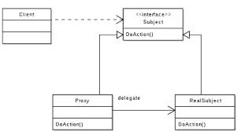

## Decorator

## Histórico de Versão

<table>
  <thead>
    <tr>
      <th>Data</th>
      <th>Autor(es)</th>
      <th>Descrição</th>
      <th>Versão</th>
    </tr>
  </thead>

  <tbody>
    <tr>
      <td>26/10/2020</td>
      <td>
        João Pedro Gomes(<a target="blank" href="https://github.com/jppgomes">jppgomes</a>) e Cauê(<a target="blank" href="https://github.com/caue96">caue96</a>)
      </td>
      <td>Adicionando utilização do proxy no projeto</td>
      <td>0.1</td>
    </tr>
  </tbody>
</table>

## Introdução

<p align="justify">&emsp;
O Pattern Proxy é um padrão Estrutural que faz parte do GoF (Gang of Four) e faz um papel intermediário entre o solicitante e o provedor. O solicitante é quem faz a requisição e o provedor entrega os recursos em resposta à requisição.
</p>
<p align="justify">&emsp;
O proxy é basicamente um encapsulador de um objeto que está realmente servindo.
</p>
<p align="justify">&emsp;
O padrão de proxy costuma ser utilizado quando se possui procedimentos complexos e é preciso fornecer uma interface simples. Também pode ser utilizado para fornecer uma camada de segurança aos objetos e uma interface local para objetos remotos em servidores diferentes.
</p>
<p align="justify">&emsp;
Outros papéis importantes do padrão são os seguintes:
</p>

* Providenciar um substituto para um objeto controlar o acesso às classes;
* Usar um nível extra de delegação para fornecer acesso controlado a um objeto;
* Adicionar um agrupador e distribuidor para proteger um componente real de complexidade indevida.
</p>

## Estrutura



Segue um exemplo do uso de proxy no código do qrcode:

### Definição do proxy em [qrcode.py](https://github.com/UnBArqDsw/2020.1_G10_QRodizio_Backend/blob/master/qrodizio/views/api/qrcode.py)
```python
def auth_required(role=EmployeeRole.basic):
    """
    Verifies if request has a valid token.
    Then calls a permission strategy
    """

class Qrcode(ABC):

    @abstractmethod
    def generate(self):
        pass

class QrcodeTable(Qrcode):
    def __init__(self):
        self.table_id = None
        self.image_data = None

    def generate(self):
        image = qrcode.make("https://google.com.br")
        buffered = BytesIO()
        image.save(buffered, format="JPEG")
        self.image_data=base64.b64encode(buffered.getvalue()).decode("utf-8")
        self.table_id = randint(0, 1000)

class QrcodeProxy(Qrcode):
    def __init__(self):
        self.qrcode = QrcodeTable()
        
    def generate(self):
        qrcode = QrcodeProxy()
        if(self.qrcode is not None):
            qrcode.generate()
            
        qrcode.generate()
```

## Referências
<ul>
<li>
REFACTORING.GURU. Strategy. Disponível em: https://refactoring.guru/pt-br/design-patterns/proxy . Acesso em: 26 de outubro. 2020.
</li>
<li>
www.devmedia.com.br - Conheça o Pattern Proxy - GoF (Gang of Four). Disponível em: https://www.devmedia.com.br/conheca-o-pattern-proxy-gof-gang-of-four/4066. Acesso em 26/10/2020
</li>
<li>
pt.wikipedia.org - Proxy (padrões de projeto). Disponível em: https://pt.wikipedia.org/wiki/Proxy_(padr%C3%B5es_de_projeto). Acesso em 26/10/2020
</li>
<li>
github.com - Proxy. Disponível em: https://github.com/kelvins/design-patterns-python/tree/main/estruturais/proxy. Acesso em 26/10/2020
</li>
</ul>
