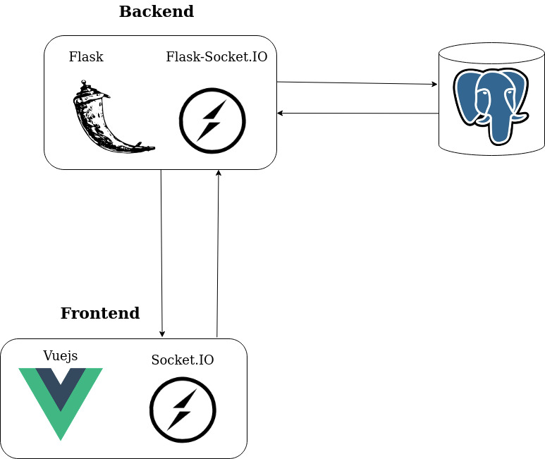
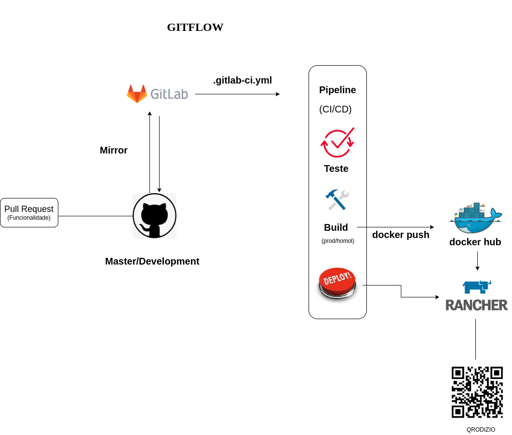

# Documento de Arquitetura

## Histórico de Revisão

<table>
<thead>
<tr>
<th>Data</th>
<th>Autor(es)</th>
<th>Descrição</th>
<th>Versão</th>
</tr>
</thead>
<tbody>
<tr>
<td>02/10/20</td>
<td>
Fábio Teixeira(<a  target="blank"  href="https://github.com/fabio1079">fabio1079</a>)
</td>
<td>Criação do documento</td>
<td>0.1</td>
</tr>
<tr>
<td>05/11/20</td>
<td>
Lucas Midlhey(<a  target="blank"  href="https://github.com/lucasmidlhey">lucasmidlhey</a>)
</td>
<td>Visão geral, Visão lógica, diagram de pacotes</td>
<td>0.2</td>
</tr>
<tr>
  <td>10/11/2020</td>
  <td>
    Caio César Beleza(<a target="blank" href="https://github.com/Caiocbeleza">Caiocbeleza</a>)
  </td>
  <td>Adicionando Visão de Processos</td>
  <td>0.3</td>
</tr>
<tr>
  <td>10/11/2020</td>
  <td>
    Caio César Beleza(<a target="blank" href="https://github.com/Caiocbeleza">Caiocbeleza</a>)
  </td>
  <td>Começando tópico de qualidade</td>
  <td>0.4</td>
</tr>
<tr>
  <td>10/11/2020</td>
  <td>
    Joao Pedro Gomes(<a target="blank" href="https://github.com/jppgomes">jppgomes</a>)
  </td>
  <td>Começando tópico de implantacao</td>
  <td>0.5</td>
</tr>
<tr>
  <td>10/11/2020</td>
  <td>
    Lucas Midlhey(<a target="blank" href="https://github.com/lucasmidlhey">lucasmidlhey</a>)
  </td>
  <td>Começando tópico de implantacao</td>
  <td>0.6</td>
</tr>
<tr>
  <td>19/11/2020</td>
  <td>
    Lucas Midlhey(<a target="blank" href="https://github.com/lucasmidlhey">lucasmidlhey</a>)
  </td>
  <td>Definições, Acrônimos e Abreviações, Visão lógica</td>
  <td>0.</td>
</tr>
</tbody>
</table>

## 1. Introdução

### 1.1 Objetivo

Este documento tem como objetivo esboçar uma visão ampla da arquitetura do QRodízio e informando as decisões significativas que foram tomadas em relação ao sistema do ponto de vista do arquiteto, desde o escopo até a visão lógica.

### 1.2 Escopo

O QRodízio visa ser uma ferramenta que auxilia no gerenciamento de mesas de rodízio e acesso a pedidos.

### 1.3 Definições, Acrônimos e Abreviações

| Termo            | Descrição                                                                                                                                                        |
| ---------------- | ---------------------------------------------------------------------------------------------------------------------------------------------------------------- |
| Web Framework(1) | estrutura de software designada para suportar o desenvolvimentos de sites web dinâmicos, aplicações web e serviços web                                           |
| Docker(2)        | Conjunto de produtos de plataformas como serviços que usam virtualização de nível de sistema operacional para entregar softawre em pacotes chamados containers   |
| Threads(3)       | Forma de um processo dividir a si mesmo em duas ou mais tarefas que podem ser executadas concorrencialmente                                                      |
| Build(4)         | versão compilada do software                                                                                                                                     |
| Code Review(5)   | Revisão de código                                                                                                                                                |
| MVT(6)           | Padrão de projeto adaptado do MVC(model, view, COntroller), model(dados), View(dados para mostrar), Template(dados apresentados visualmente)                     |
| GRASP(7)         | General responsibility assignment software patterns, consiste em diretrizes para atribuir responsabilidades a classes e objetos em projetos orientados a objetos |

### 1.4 Referências

- What is Vue.js? Em: vuejs.org. Disponível em: [https://vuejs.org/v2/guide/](https://vuejs.org/v2/guide/). Acesso em: 2 de outubro de 2020.

- Flask (framework web). In: WIKIPÉDIA: a enciclopédia livre. Disponível em: [https://pt.wikipedia.org/wiki/Flask\_(framework_web)](<https://pt.wikipedia.org/wiki/Flask_(framework_web)>). Acesso em: 2 de outubro de 2020.

- Socket.IO. Em: WIKIPÉDIA: a enciclopédia livre. Disponível em: [https://en.wikipedia.org/wiki/Socket.IO)](https://en.wikipedia.org/wiki/Socket.IO). Acesso em: 2 de outubro de 2020.

- O que é Vuex? Em: vuex.vuejs.org. Disponível em: [https://vuex.vuejs.org/ptbr/](https://vuex.vuejs.org/ptbr/). Acesso em: 2 de outubro de 2020.

- Diretriz: Visão Arquitetural. Disponível em: https://www.trt9.jus.br/pds/v1-1/pdstrt9/guidances/guidelines/architectural_view_FF6EDA37.html#:~:text=Vis%C3%A3o%20de%20Processo%3A%20Descreve%20como,de%20tempo%2Dde%2Dexecu%C3%A7%C3%A3o.&text=Vis%C3%A3o%20de%20Implanta%C3%A7%C3%A3o%3A%20Descreve%20como,uso%20das%20Vis%C3%B5es%204%2B1. Acesso em: 10 de novembro. 2020.

- Visões Arquiteturais. Disponível em: http://www.inf.ufpr.br/andrey/ci163/VisoesAl.pdf. Acesso em: 10 de novembro. 2020.

### 1.5 Visão Geral

Neste documento traremos alguns pontos que elucidam melhor a arquitetura do projeto detalhando suas representações e casos. Iremos abordar representação da arquitetura, objetivos e restrições, visão caso de uso, lógica, processos e implantação, qualidade, tamanho e desempenho.

## 2. Representação da Arquitetura

### 2.1 Tecnologias utilizadas

#### Vuejs

Web framework(1) progressivo para construção de interfaces de usuário. Vue foi desenhado para ser de fácil utilização e incrementalmente adicionável a qualquer projeto. O foco do Vue está na camada de visualização e criação de single page applications.

#### Flask

Flask é um pequeno framework web escrito em Python e baseado na biblioteca WSGI Werkzeug e na biblioteca de Jinja2. Flask está disponível sob os termos da Licença BSD.

#### Socket.IO

Socket.IO é uma biblioteca JavaScript para aplicativos da web em tempo real. Permite comunicação bidirecional em tempo real entre clientes e servidores da Web. Ele tem duas partes: uma biblioteca do lado do cliente que é executada no navegador e uma biblioteca do lado do servidor para o Node.js.

#### Vuex

O Vuex é um padrão de gerenciamento de estado + biblioteca para aplicativos Vue.js. Ele serve como um store centralizado para todos os componentes em uma aplicação, com regras garantindo que o estado só possa ser mutado de forma previsível.

### 2.1 Representação arquitetural

#### Visão geral

#### Vuex

## 3. Objetivos e Restrições de Arquitetura

### 3.1 Objetivos

O software deve ter acesso a uma camera e internet para poder ser utilizado. Seu objetivo é poder automatizar um restaurante com principal foco em rodízio.

### 3.2 Restrições

#### 3.2.1 Suportabilidade

A aplicação deverá ser suportada pelos navegadores, Mozilla Firefox, Google Chrome e Microsoft Edge.

#### 3.2.2 Ferramentas

Toda parte do frontend será construída utilizando Vuejs, biblioteca de JavaScript para criar interfaces para o usuário, juntamente com Vuex para o gerenciamento de stado da aplicação pelo lado do usuário. A aplicação também utilizará do microframework Flask, que é construído em python e que juntamente com a biblioteca Socket.IO/Flask-Socket.IO fará a comunicação em tempo real entre usuário e servidor.

Para facilitar no desenvolvimento a ferramenta Docker(2) será utilizada garantindo que todos no desenvolvimento estão utilizando o mesmo ambiente e configurações.

#### 3.2.3 Usabilidade

O software nao necessita de download tornando de mais facil acesso para o usuário.

## 4. Casos de Uso

O diagrama de casos de uso auxiliam a comunicação entre os papéis dentro do software apresentando as principais funcionalidades focando no cliente, descrevendo cenários de interação entre as partes internas e externas do sistema com foco no usuário.

Nossos casos de uso foram criados no inicio do projeto para auxiliar o levantamento de requisitos.

[Visão atual ](https://unbarqdsw.github.io/2020.1_G10_QRodizio/modelagem/diagramas_dinamicos/diagrama_casos_de_uso.html#versoes-2-0)

[Rastreabilidade](https://unbarqdsw.github.io/2020.1_G10_QRodizio/modelagem/diagramas_dinamicos/diagrama_casos_de_uso.html#versoes-2-0)

## 5. Visão lógica

Descrevemos como o sistema é estruturado, em termos de unidades de implementação. Os elementos são pacotes, classes e interfaces. O relacionamento entre os elementos mostra as dependências, as realizações de interface, os relacionamentos parte-todo e assim por diante.
O usuário acessa a camada Template no modelo MVT, onde sera responsável por interpretar os eventos do front-end para a comunicação de nossa API, em uma comunicação em requisições HTTP.
O back-end terá comunicação direta com o banco de dados, gerenciada que camada de View, que no modelo tradicional faria uma função da controller, interpretando, tratando e autenticando dados sendo capaz de diferenciar rotas e alimentando a camada Template.
A camada Model é capaz de estruturar os esquemas das classes e atributos do software, capaz de modificar os registros do banco de dados.

### 5.1 Visão de pacotes

Muito utilizado para ilustrar a arquitetura de um sistema mostrando o agrupamento de suas classes dividindo entre pedaços do sistema lógico e dependência entre eles.

[diagrama de pacotes](https://unbarqdsw.github.io/2020.1_G10_QRodizio/modelagem/diagramas_estaticos/diagramas_pacote.html#versoes-1-0)

## 6. Visão de processos

A visão de processos ilustra a interação e os comportamentos de um conjuto de elementos em tempo-de-execução(Processos, threads(3), atividades, etc.) e mostra como se dá a comunicação e a concorrência dessas threads(3). A visão dos processos empregados no projeto, que ilustram os principais fluxos de comunicações do sistema, podem ser encontradas nos seguintes documentos:

[Diagamas de Sequência](https://github.com/UnBArqDsw/2020.1_G10_QRodizio/blob/master/docs/modelagem/diagramas_dinamicos/diagrama_sequencia.md)

[Diagramas de Atividade](https://github.com/UnBArqDsw/2020.1_G10_QRodizio/blob/master/docs/modelagem/diagramas_dinamicos/diagramas_atividade.md)

## 7. Visão de implantação

Pode-se descrever, em alto nível, as seguintes etapas para a implantação do software nos ambientes de produção:

- Pull request da funcionalidade para a branch de desenvolvimento;
- Análise estática do código e build do software através de um sistema de integração contínua;
- Mesclagem do código na branch de desenvolvimento;
- Deploy do software para o ambiente de homologação (staging);
- Mesclagem do código na branch master;
- Deploy do software para o ambiente de produção.

Ferramentas:

- Docker(2)
- Gitlab
- Github
- Pytest

### 7.1. Back-end (API)

O processo de implantação para a API contém múltiplas etapas para assegurar que o código que chegue aos ambientes de produção foi verificado e validado com o uso de ferramentas automáticas e a prática de code review(5).

### 7.2. Front-end (UI)

As implantações na interface de usuário seguirão o mesmo princípio, mudando apenas, se necessário, as ferramentas automáticas. Além disso, é importante que a interface de usuário seja validada através de testes com pessoas.

## 8. Visão de Implementação

A visão de implementação permite compreender a distribuição física do sistema analisando o fluxo de trabalho sob o design. Seu principal foco é ilustrar a distribuição do processamento em conjunto de nós do sistema, incluindo uma distriução física dos processos.

As camadas do nossos software são:

- Funcionário
- Pedidos
- Cliente
- Banco de dados

Cada camada existem sub camadas que tem uma função específica e nelas um relacionamento de processos capaz de gerir e manter o sistema.

O [diagrama de componentes](https://unbarqdsw.github.io/2020.1_G10_QRodizio/modelagem/diagramas_estaticos/diagrama_componentes.html) ilustra bem as camadas e subcamadas.

### 8.1 Camadas e subcamadas

Para entender cada camada se faz uma analise do [diagrama de classes](https://unbarqdsw.github.io/2020.1_G10_QRodizio/modelagem/diagramas_estaticos/diagrama_classes.html#diagrama) onde mostra com mais detalhes cada método de cada subcamada

- 1.Funcionário
  - 1.1. Autenticação
  - 1.2. Autenticação gerente
     
- 2.Pedidos
  - 2.1. Pedidos pendentes
  - 2.2. Pedidos finalizados
  - 2.3. Novo pedido
     
- 3.Cliente
  - 3.1. Mesa
  - 3.2. pagamento
     
- 4.Banco de dados
  - 4.1. dados

## 9. Tamanho e Desempenho

## 10. Qualidade

A arquitetura adotada, utilizada como adaptação MVT(6), oferece uma organização das camadas da aplicação possibilitando aos desenvolvedores uma fácil manutenção.
Seguimos alguns padrões [GRASP](https://unbarqdsw.github.io/2020.1_G10_QRodizio/design_patterns/grasps/grasps.html)(7). Para ter uma extensibilidade podendo acomplar novos comportamentos para objetos utilizamos como padrão estrutural o [Decorator](https://unbarqdsw.github.io/2020.1_G10_QRodizio/design_patterns/padroes_estruturais/decorator.html#decorator).
Para manutenção, portabilidade e futuras features utilizamos padrões criacionais entre eles [builder](https://unbarqdsw.github.io/2020.1_G10_QRodizio/design_patterns/padoes_criacionais/builder.html#builder), [factory](https://unbarqdsw.github.io/2020.1_G10_QRodizio/design_patterns/padoes_criacionais/factory.html#factory), [singleton](https://unbarqdsw.github.io/2020.1_G10_QRodizio/design_patterns/padoes_criacionais/singleton.html).
E seguimos alguns padrões comportamentais capazes de trazer confiabilidade tais como [strategy](https://unbarqdsw.github.io/2020.1_G10_QRodizio/design_patterns/padroes_comportamentais/strategy.html#strategy) e [observer](https://unbarqdsw.github.io/2020.1_G10_QRodizio/design_patterns/padroes_comportamentais/observer.html#historico-de-versao).

Além disso, foram feitos [NFR's](https://github.com/UnBArqDsw/2020.1_G10_QRodizio/blob/master/docs/iniciativas_extra/NFR.md), que ilustram requisitos não funcionais, que também objetivam aumentar a qualidade do sistema, mas em aspectos como eficiência, segurança, etc.

| Itens         | Descrição                                                                                                                                                                                                                                                                                  |
| ------------- | ------------------------------------------------------------------------------------------------------------------------------------------------------------------------------------------------------------------------------------------------------------------------------------------ |
| Segurança     | Fui usado uma biblioteca do python, bcrypt e jwt que são capazez de fazer a encriptação e decodificação de senhas para funcionários. Foi utilizado também tokens para criar varias sessões em uma mesa tornando uma unica sessão para cada usuário que desejar                             |
| Usabilidade   | A manutenção das partes provem das tecnologias escolhidas e o ambiente exclusivo para o back-end podendo assim criar um novo módulo para o Front-end, como por exemplo um app. A utilização de frameworks como socket.io, vue.js auxiliam a curva de aprendizado para novos contribuidores |
| Portabilidade | A utilização do Docker permite um ambiente estável auxiliando assim possíveis novos módulos. A API permite requisições HTTPs sendo de facil aprimoramento com novos módulos de Front-end                                                                                                   |
| Eficiencia    | Utilizamos padrões de projeto principalmente na API resolvendo um problema de design existente. A utilização de socket's assíncronos permite uma troca de mensagens mais rápida. A escolha por WebApp permite uma facil execução por parte do usuário                                      |
