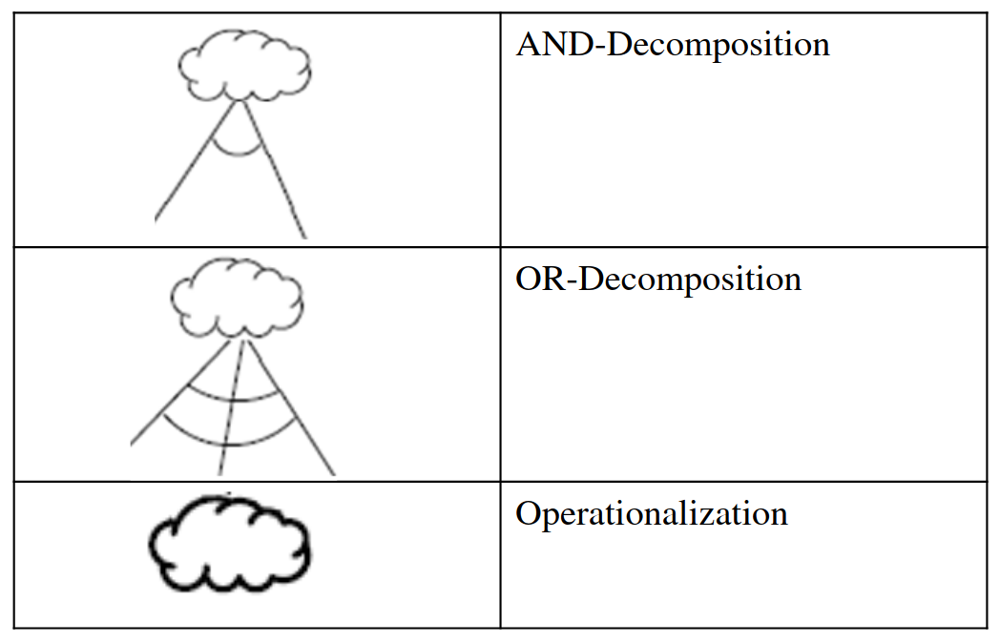
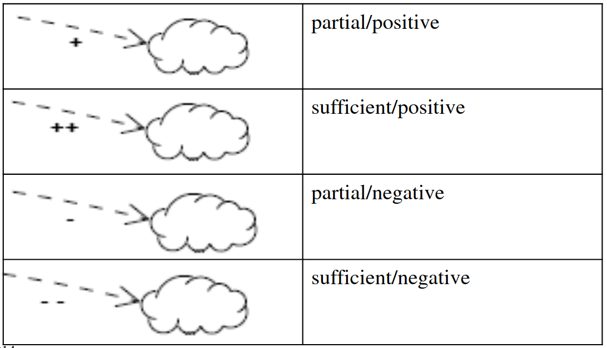
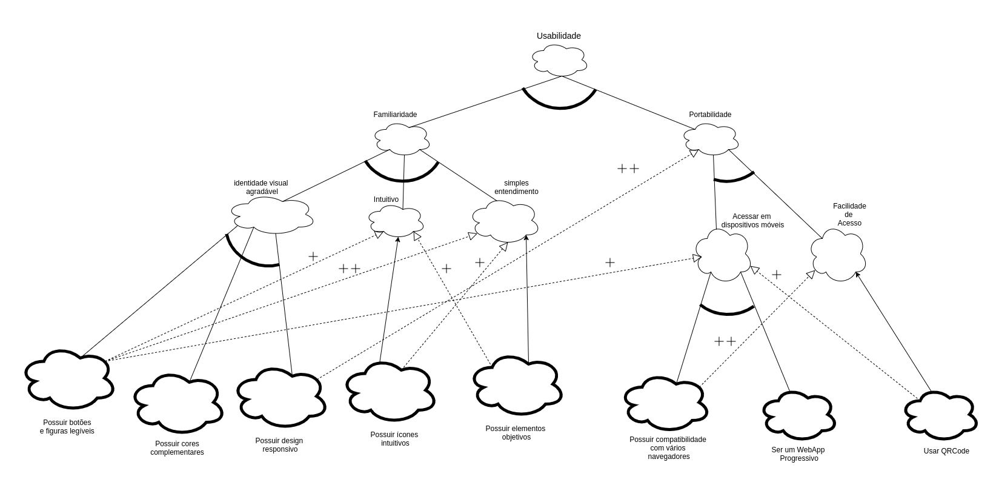
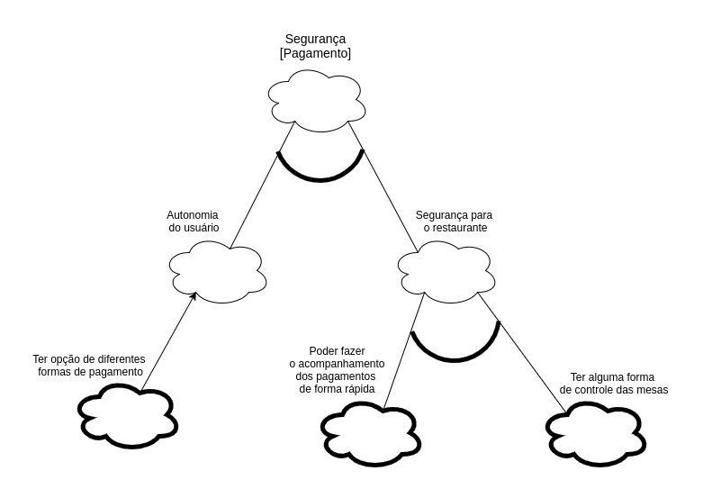
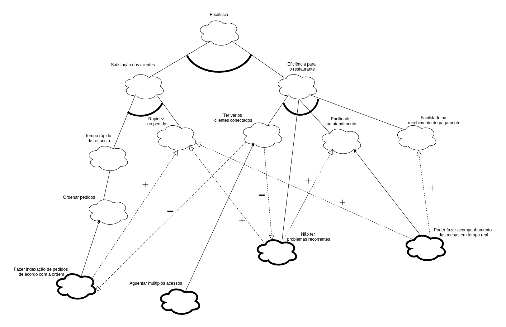
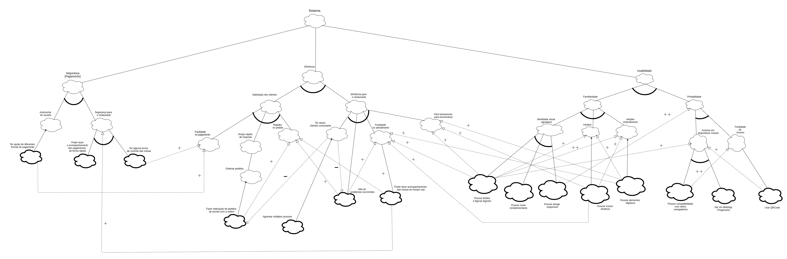

## NFR Framework

## Histórico de Revisões

<table>
  <thead>
    <tr>
      <th>Data</th>
      <th>Versão</th>
      <th>Descrição</th>
      <th>Autor(es)</th>
    </tr>
  </thead>

  <tbody>
    <tr>
      <td>28/09/2020</td>
      <td>0.1</td>
      <td>Adicionando Introdução de NFR</td>
      <td>
        Caio César Beleza(<a target="blank" href="https://github.com/Caiocbeleza">Caiocbeleza</a>)
      </td>
    </tr>
    <tr>
      <td>28/09/2020</td>
      <td>0.2</td>
      <td>Adicionando NFR usabilidade</td>
      <td>
        Caio César Beleza(<a target="blank" href="https://github.com/Caiocbeleza">Caiocbeleza</a>)
      </td>
    </tr>
    <tr>
      <td>28/09/2020</td>
      <td>0.3</td>
      <td>Adicionando NFR Segurança de Pagamento</td>
      <td>
        Caio César Beleza(<a target="blank" href="https://github.com/Caiocbeleza">Caiocbeleza</a>)
      </td>
    </tr>
    <tr>
      <td>28/09/2020</td>
      <td>0.4</td>
      <td>Adicionando NFR eficiência</td>
      <td>
        Caio César Beleza(<a target="blank" href="https://github.com/Caiocbeleza">Caiocbeleza</a>)
      </td>
    </tr>
    <tr>
      <td>28/09/2020</td>
      <td>0.5</td>
      <td>Adicionando NFR sistema</td>
      <td>
        Caio César Beleza(<a target="blank" href="https://github.com/Caiocbeleza">Caiocbeleza</a>)
      </td>
    </tr>

  </tbody>
</table>

## 1. Introdução

&emsp;
Requisitos não funcionais em um sistema de software não descrevem o que o software irá fazer, mas como o software irá fazer, levando em consideração características que não são funcionais, como performance, requisitos de interface, design e qualidade(CHUNG et al, 2012).

&emsp;
Os requisitos não funcionais podem ser subjetivos, já que podem ser interpretados de forma diferente, dependendo do ponto de vista da pessoa que os está avaliando(CHUNG et al, 2012).

&emsp;
O NFR framework tem como foco a modelagem dos requisitos não funcionais.

&emsp;
A modelagem começa com os "softgoals", que são as qualidades do sistema num nível mais abrangente de abstração e são decompostos e refinados até descobrirem uma estrutura de metas e sub-objetivos(DOS REIS NUNES, LEAL).

#### Notação NFR

#### Contribuições de softgoals

&emsp;
O NFR framework foi utilizado neste projeto para auxiliar na elicitação dos requisitos não funcionais do sistema.

## Versões 1.0

### Autor: [Caio](https://github.com/Caiocbeleza)

NFR Usabilidade

### Autor: [Caio](https://github.com/Caiocbeleza)

### Autor: [Caio](https://github.com/Caiocbeleza)

### Autor: [Caio](https://github.com/Caiocbeleza)

## Referências
<ul>
<li>
CHUNG, Lawrence et al. Non-functional requirements in software engineering. Springer Science & Business Media, 2012.</li>
<li>
DOS REIS NUNES, Gustavo Garcia; LEAL, André Castro. NON-FUNCTIONAL REQUIREMENTS FRAMEWORK: INFLUÊNCIAS NA​​​​ QUALIDADE DE JOGOS DE ENTRETENIMENTO COM TEMÁTICA​​ ROLE-PLAYING GAME.
</li>
<li>
REQUIREMENTS ENGINEERING INTRODUCTION.Requisitos Não-Funcionais. Disponível em: https://www.cin.ufpe.br/~if716/arquivos20152/experimentoBruno/Aula2/Aula2-Parte2-NFR%20Framework.pdf . Acesso em 28 de setembro. 2020.
</li>
</ul>
