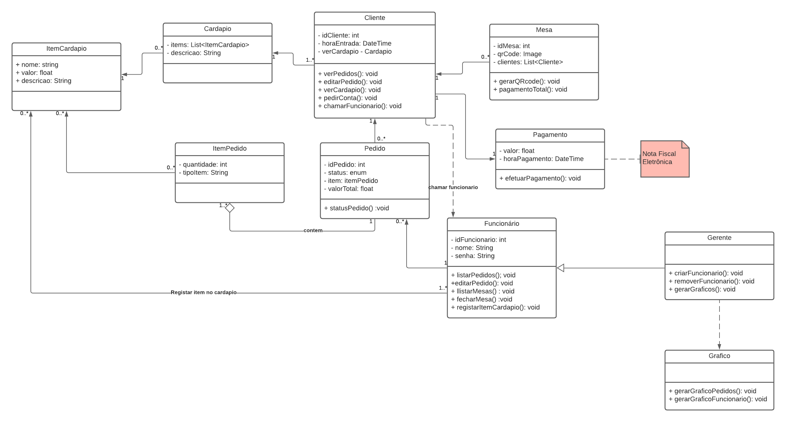

# Diagrama de classes

## Histórico de versões

| Data     | Autor(es)         | Descrição            | Versão |
| -------- | ------------- | -------------------- | ------ |
| 18/09/20 | Lucas Midlhey(<a target="blank" href="https://github.com/lucasmidlhey">Lucas Midlhey</a>), Fábio Teixeira(<a target="blank" href="https://github.com/fabio1079">fabio1079</a>)| Criação do diagrama | 0.1    |

## Introdução

Este diagrama tem como objetivo trazer a estrutura de um sistema ao modelar suas classes, seus atributos, operações e relações entre objetos. Ao criar um diagrama de classes consegue-se ilustrar modelos de dados para sistemas de informação, entender melhor a visão geral dos esquemas de uma aplicação, expressar visualmente as necessidades específicas de um sistema e fornecer uma descrição independente da implementação de tipos utilizados. 
Analisamos nosso backlog do produto e constituímos o diagrama a partir dos Must Have e alguns Could Have utilizando a ferramenta [ lucidchar](https://app.lucidchart.com/).

### versão 1

