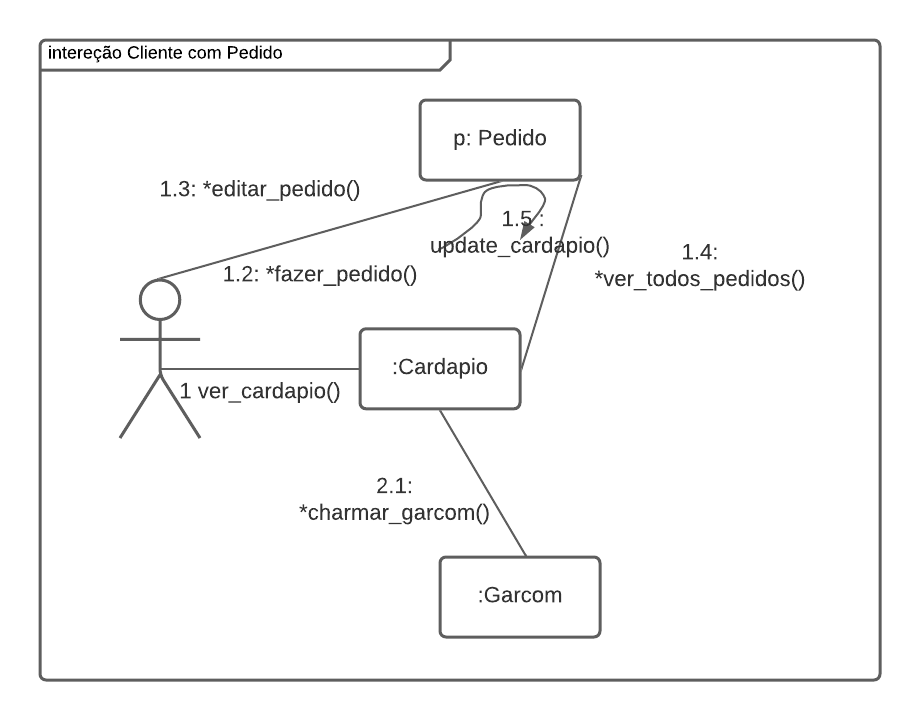
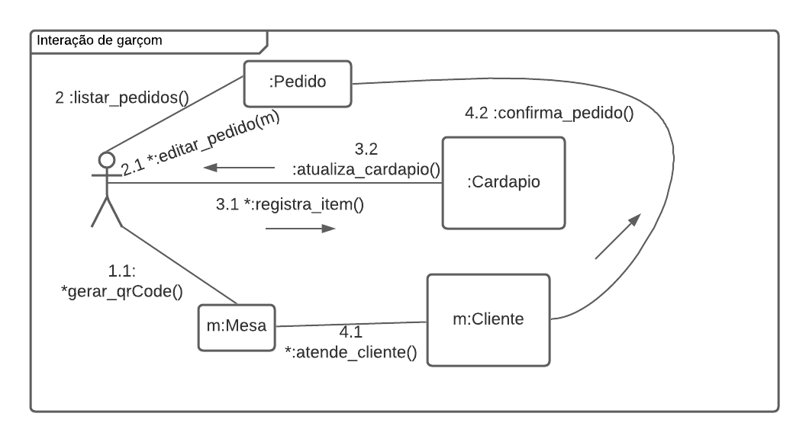
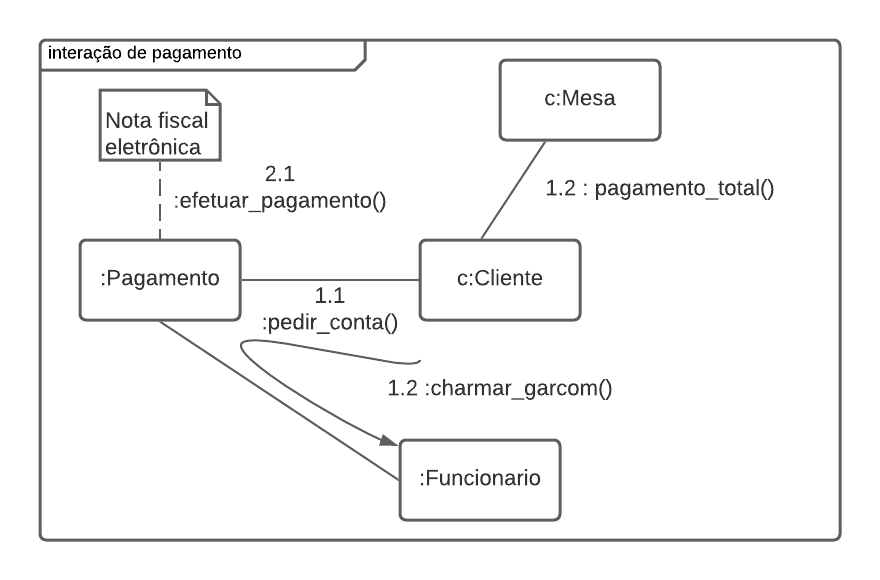

# Diagrama de comunicação

## Histórico de versões

| Data     | Autor(es)         | Descrição            | Versão |
| -------- | ------------- | -------------------- | ------ |
| 21/09/20 | Lucas Midlhey(<a target="blank" href="https://github.com/lucasmidlhey">Lucas Midlhey</a>)| Criação do diagrama(Cliente) | 0.1    |
| 22/09/20 | Lucas Midlhey(<a target="blank" href="https://github.com/lucasmidlhey">Lucas Midlhey</a>)| diagrama(Funcionario, Pagamento) | 0.2    |

## Introdução

Diagrama de comunicação, também chamado de diagrama de colaboração tem como propósito mostrar as interações UML entre objetos e/ou partes usando mensagens sequenciadas de forma livre.
Este diagrama corresponde a um diagrama de sequenciai simples e sem mecanismos de estruturação.
Analisamos nosso diagrama de classes e constituímos o diagrama a partir dos processos tentando trazer mais clareza para as cardialidades. Utilizamos a ferramenta [ lucidchar](https://app.lucidchart.com/).

### Cliente

### Funcionário

### Pagamento

