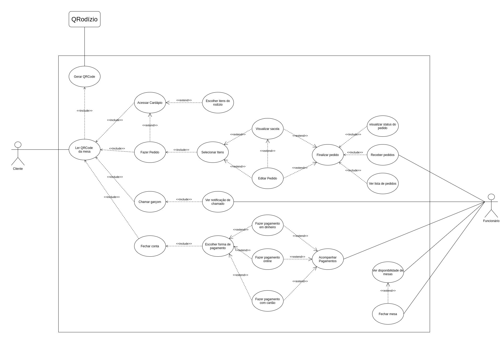
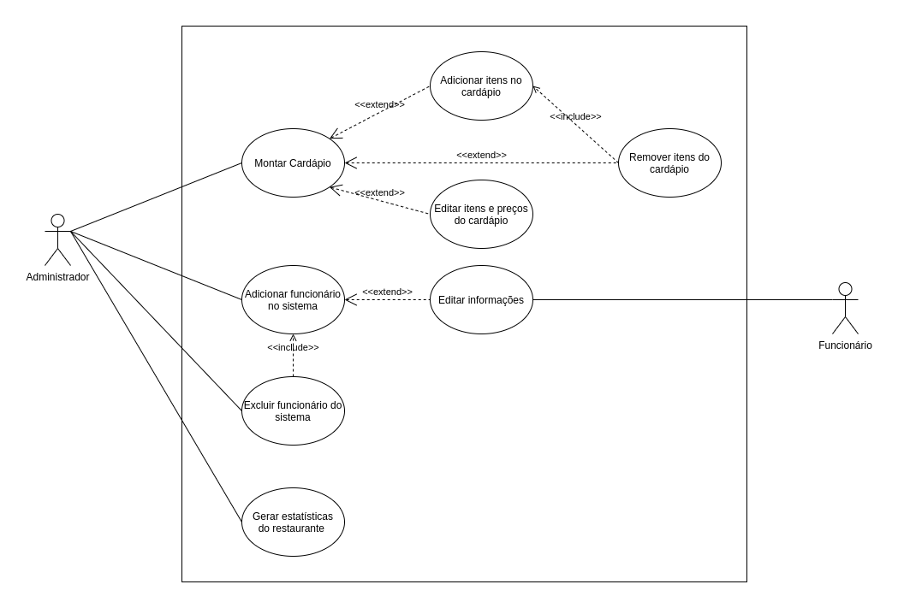
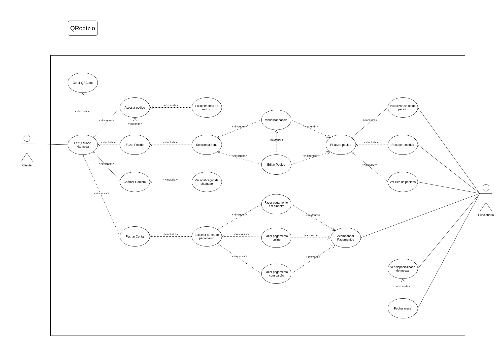

## Casos de Uso
## Histórico de Versão

<table>
  <thead>
    <tr>
      <th>Data</th>
      <th>Autor(es)</th>
      <th>Descrição</th>
      <th>Versão</th>
    </tr>
  </thead>

  <tbody>
    <tr>
      <td>28/09/2020</td>
      <td>
        Caio César Beleza(<a target="blank" href="https://github.com/Caiocbeleza">Caiocbeleza</a>)
      </td>
      <td>Adicionando introdução de diagrama de casos de uso </td>
      <td>0.1</td>
    </tr>
    <tr>
      <td>28/09/2020</td>
      <td>
        Caio César Beleza(<a target="blank" href="https://github.com/Caiocbeleza">Caiocbeleza</a>)
      </td>
      <td>Adicionando diagrama de casos de uso do cliente</td>
      <td>0.2</td>
    </tr>
    <tr>
      <td>28/09/2020</td>
      <td>
        Caio César Beleza(<a target="blank" href="https://github.com/Caiocbeleza">Caiocbeleza</a>)
      </td>
      <td>Adicionando diagrama de casos de uso do administrador</td>
      <td>0.3</td>
    </tr>
    <tr>
      <td>20/10/2020</td>
      <td>
        Caio César Beleza(<a target="blank" href="https://github.com/Caiocbeleza">Caiocbeleza</a>)
      </td>
      <td>Adicionando versão corrigida do diagrama de casos de uso do cliente e funcionário segundo feedback da entrega e adicionando a rastreabilidade</td>
      <td>0.4</td>
    </tr>
  </tbody>
</table>

## Introdução

&emsp;
O diagrama de casos de uso mostra as formas de interações dos usuários com o sistema, utilizando um conjunto de símbolos e conectores especializados.

&emsp;
Esse diagrama contém as seguintes notações:

&emsp;
Atores: Representa uma pessoa ou sistema

&emsp;
Casos de uso: Representa uma funcionalidade do sistema.

&emsp;
Relacionamentos: Interação entre os atores e os casos de uso.
<ul>
<li>
Relacionamento de comunicação ou associação: Representa a interação entre um ator e um caso de uso.
</li>
<li>
Relacionamento de Inclusão: Utilizado quando um comportamento se repete em mais de um caso de uso.
</li>
<li>
Relacionamento de extensão: Utilizado quando existem casos alternativos derivados de um outro caso de uso.
</li>
<li>
Relacionamento de herança: Relacionamento entre atores, utilizado para representar uma generalização.
</li>
</ul>

&emsp;
Os diagramas de casos de uso foram utilizados no projeto para ilustrar a interação entre os componentes do sistema e ajudar a visualização das funcionalidades que os usuários poderam utilizar.

## Versões 1.0

### Autor: [Caio](https://github.com/Caiocbeleza)

### Autor: [Caio](https://github.com/Caiocbeleza)

## Versões 2.0

### Autor: [Caio](https://github.com/Caiocbeleza)

### Rastreabilidade

Os diagramas acima ilustram as seguintes funcionalidades do [Backlog](../../docs/backlog/backlog_produtov2.md)

|ID|Descrição|
|--|--|
|a03|O sistema deve permitir visualizar gráficos de consumo|
|a04|O sistema deve permitir remover funcionários|
|a05|O sistema deve permitir Cadastrar cardápio geral|
|c01|O cliente deve poder ler QR Code|
|c02|O cliente deve poder acessar o cardápio|
|c03|O cliente deve poder realizar pedidos|
|c04|O cliente deve poder cancelar pedidos|
|c05|O cliente deve poder visualizar pedidos|
|c07|O cliente deve poder escolher forma de pagamento|
|c08|O cliente deve poder Chamar garçom|
|c16|O cliente deve poder visualizar status do pedido(aguardando,processando,feito)|
|f01|O sistema deve permitir o cadastro de funcionários|
|f04|O sistema deve permitir Fechar mesa|
|f05|O sistema deve permitir Cadastrar cardápio do dia|
|f06|O sistema deve permitir ao funcionário ver se a mesa está livre ou ocupada|
|f07|O sistema deve notificar ao funcionário sobre novos pedidos|
|f08|O sistema deve permitir ao funcionário alterar seus dados|
|s01|O sistema deve gerar QR Code|
|s04|O sistema deve poder gerar gráficos(consumo,mais pedidos, etc)|
|s05|Gerar estatísticas|

## Referências
<ul>
<li>
MEDIUM. UML — Diagrama de Casos de Uso. Disponível em: https://medium.com/operacionalti/uml-diagrama-de-casos-de-uso-29f4358ce4d5 . Acesso em: 28 de setembro. 2020.
</li>
<li>
LUCIDCHART.
Diagrama de caso de uso UML: O que é, como fazer e exemplos. Disponível em: https://www.lucidchart.com/pages/pt/diagrama-de-caso-de-uso-uml . Acesso em: 28 de setembro. 2020.
</li>
<li>
DEVMEDIA. O que é UML e Diagramas de Caso de Uso: Introdução Prática à UML. Disponível em: https://www.devmedia.com.br/o-que-e-uml-e-diagramas-de-caso-de-uso-introducao-pratica-a-uml/23408 . Acesso em: 28 de setembro. 2020.
</li>
</ul>
