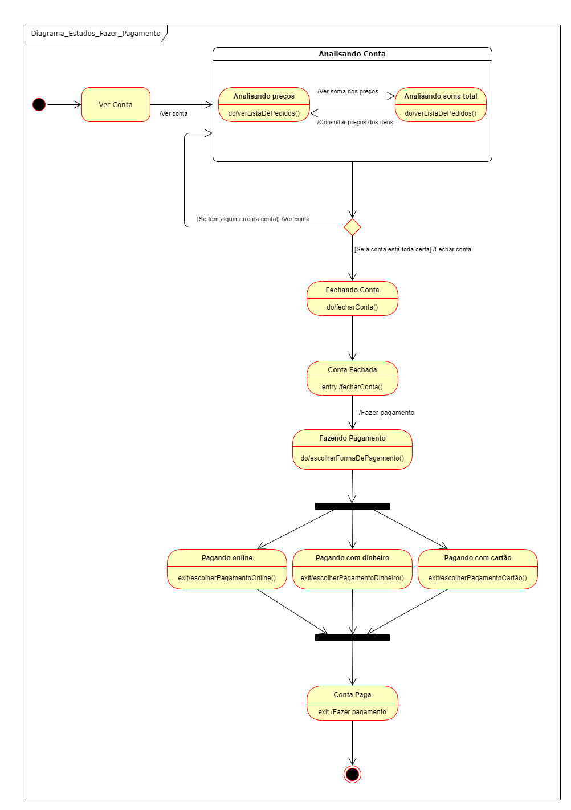
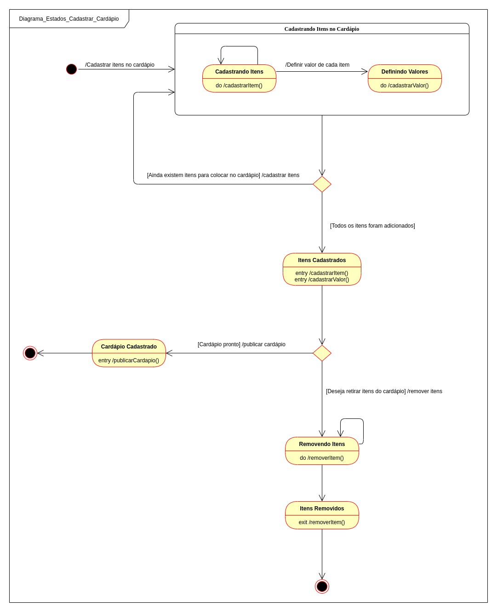

# Diagrama de Estados
## Histórico de Versão

<table>
  <thead>
    <tr>
      <th>Data</th>
      <th>Autor(es)</th>   
      <th>Descrição</th>
      <th>Versão</th>  
    </tr>
  </thead>

  <tbody>
    <tr>
      <td>17/09/2020</td>
      <td>
        Caio César Beleza(<a target="blank" href="https://github.com/Caiocbeleza">Caiocbeleza</a>)
      </td>
      <td>Adicionando introdução de diagrama de estados </td>
      <td>0.1</td>
    </tr>
    <tr>
      <td>17/09/2020</td>
      <td>
        Caio César Beleza(<a target="blank" href="https://github.com/Caiocbeleza">Caiocbeleza</a>)
      </td>
      <td>Adicionando diagrama de estados dos pedidos</td>
      <td>0.2</td>
    </tr>
    <tr>
      <td>22/09/2020</td>
      <td>
        Caio César Beleza(<a target="blank" href="https://github.com/Caiocbeleza">Caiocbeleza</a>)
      </td>
      <td>Adicionando diagrama de estados do Pagamento</td>
      <td>0.3</td>
    </tr>
    <tr>
      <td>23/09/2020</td>
      <td>
        Caio César Beleza(<a target="blank" href="https://github.com/Caiocbeleza">Caiocbeleza</a>)
      </td>
      <td>Adicionando diagrama de estados do Cadastro de Cardápio</td>
      <td>0.4</td>
    </tr>
  </tbody>
</table>

## Introdução

&emsp;
Diagrama de estados, também conhecido como diagrama de máquina de estados, é um tipo de diagrama UML(Linguagem de Modelagem Unificada), que mostra transições entre objetos. Esse tipo de diagrama armazena os status de um objeto em um determinado momento e pode mudar de status ou causar outras ações baseado na entreda que recebe.

&emsp;
Os diagramas de estado contam com alguns elementos:

Estado inicial: Ponto inicial, onde começa a utilização do objeto.

Estado final: Ponto de saída do objeto.

Estado: Representa um dos possíveis estados que um objeto pode ter.

Evento ou Transição: Representa uma ação externa sobre um objeto.

Ações: Processo associado à transição de estados. São representadas por "/", seguidas das ações contidas no estado. As ações são: - Ação de entrada(entry): executada para chegar a algum estado; - Ação de saída(exit): executada quando se sai de um estado; Ação de atividade(do): é executada dentro do estado.

&emsp;
Utilizamos os diagramas de estados para mostrar as transições de estados dos fluxos principais da aplicação.

## Versões 1.0

### Autor: [Caio](https://github.com/Caiocbeleza)

### Autor: [Caio](https://github.com/Caiocbeleza)

### Autor: [Caio](https://github.com/Caiocbeleza)

## Referências
<ul>
<li>LUCIDCHART.
O que é um diagrama de máquina de estados?. Disponível em: https://www.lucidchart.com/pages/pt/o-que-e-diagrama-de-maquina-de-estados-uml . Acesso em: 17 de setembro. 2020. </li>
<li>
Máquina de Estados. Disponível em: http://msoo.pbworks.com/f/Diagrama+de+Estados.pdf . Acesso em: 22 de setembro. 2020.
</li>
</ul>
