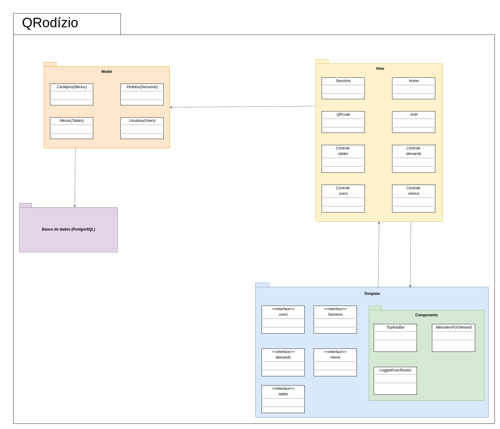

# Diagrama de Pacotes

## Histórico de Versão

<table>
  <thead>
    <tr>
      <th>Data</th>
      <th>Autor(es)</th>   
      <th>Descrição</th>
      <th>Versão</th>  
    </tr>
  </thead>

  <tbody>
    <tr>
      <td>17/09/2020</td>
      <td>João Pedro Gomes(<a target="blank" href="https://github.com/jppgomes">jppgomes</a>)</td>
      <td>Adicionando diagrama de pacotes</td>
      <td>0.1</td>
    </tr>
    <tr>
      <td>15/11/2020</td>
      <td>
        Caio César Beleza(<a target="blank" href="https://github.com/Caiocbeleza">Caiocbeleza</a>)
      </td>
      <td>Adicionando versão 2.0 do diagrama de pacotes</td>
      <td>0.2</td>
    </tr>
  </tbody>
</table>

## Introdução

&emsp;
O Diagrama de pacotes, ou diagrama de módulos, definido pela UML, descreve os pacotes ou pedaços do sistema divididos em agrupamentos lógicos mostrando as dependências entre eles. Este diagrama é muito utilizado para ilustrar a arquitetura de um sistema mostrando o agrupamento de suas classes.

&emsp;
Foi definido que seria necessário a utilização do diagrama de pacotes no projeto para ilustrar como estão funcionando o agrupamento das classes do sistema e suas interações umas com as outras, contendo em cada pacote os principais elementos da estrutura MVT aplicada, que é uma adaptação do MVC.

## Versões 1.0

### Autor: [João Pedro Gomes](https://github.com/jppgomes)

## Versões 2.0

### Autor: [Caio César Beleza](https://github.com/Caiocbeleza)

## Referências
<ul>
<li>https://pt.wikipedia.org/wiki/Diagrama_de_pacotes#:~:text=O%20Diagrama%20de%20pacotes%2C%20ou,o%20agrupamento%20de%20suas%20classes.</li>
<li>
MICREIROS.COM. Diagramas Estruturais da UML: Diagrama de Pacotes. Disponível em: https://micreiros.com/diagrama-de-pacotes/. Acesso em: 15 de novembro. 2020.
</li>
</ul>
