# Protótipo

## Histórico de versões

| Data     | Autor(es)         | Descrição            | Versão |
| -------- | ------------- | -------------------- | ------ |
| 11/09/20 | Lucas Midlhey(<a target="blank" href="https://github.com/lucasmidlhey">Lucas Midlhey</a>), Fábio Teixeira(<a target="blank" href="https://github.com/fabio1079">fabio1079</a>) | Primeiras paginas do protótipo | 0.1    |
| 15/09/20 | Lucas Midlhey(<a target="blank" href="https://github.com/lucasmidlhey">Lucas Midlhey</a>)| Remodelando cores e novas paginas | 0.2    |
| 18/09/20 | Lucas Midlhey(<a target="blank" href="https://github.com/lucasmidlhey">Lucas Midlhey</a>)| Paginas de cliente pronta | 0.2    |

## Introdução

A partir dos nossos primeiros artefatos e da ideia de fazer um design sprint ficou definido que seria necessário fazer um protótipo, principalmente para analisar as paginas que seriam necessárias associando com os requisitos e o backlog do produto.
Fizemos um mapeamento dos "Must Have" do backlog do produto e levantamos as primeiras páginas, logo depois vimos a necessidade de separar em 3 visões, cliente, funcionário e gerente.

### Visão do Cliente

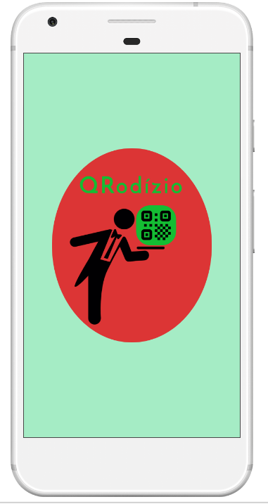
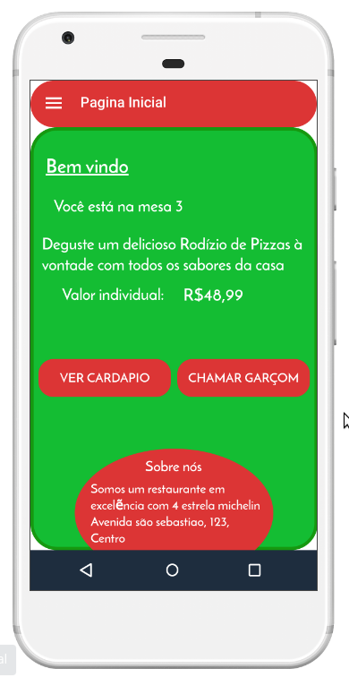
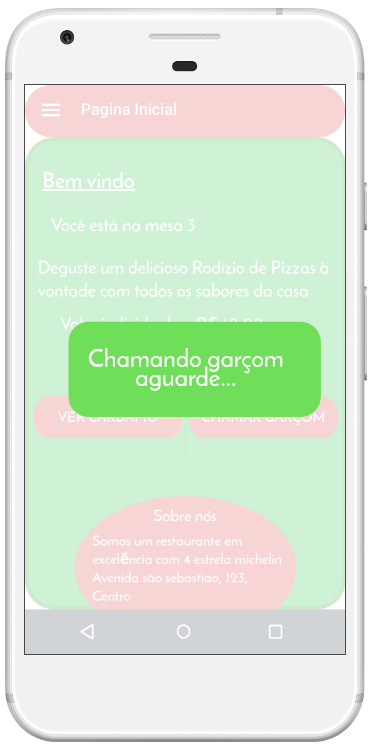
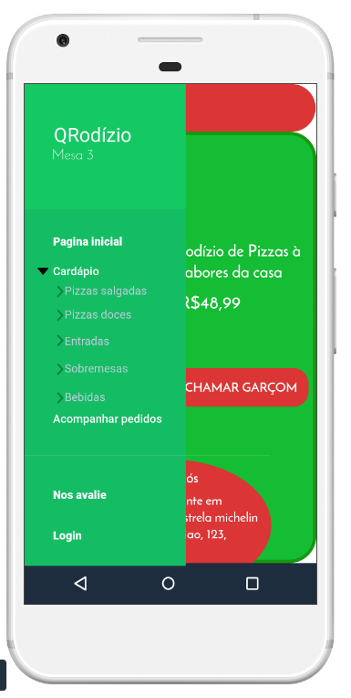

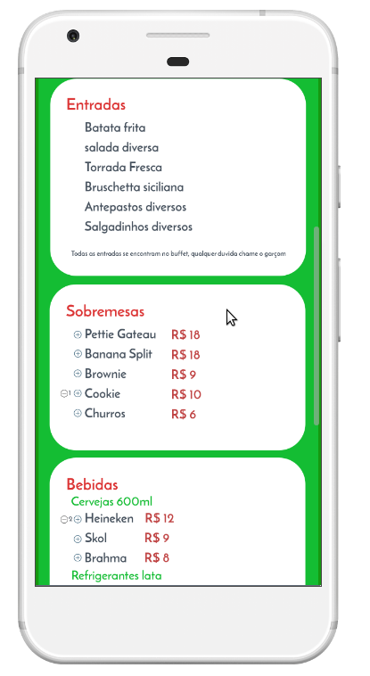
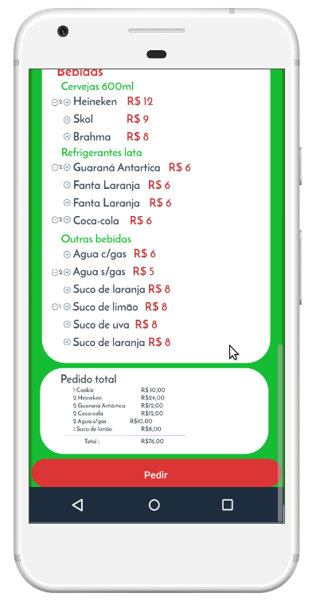
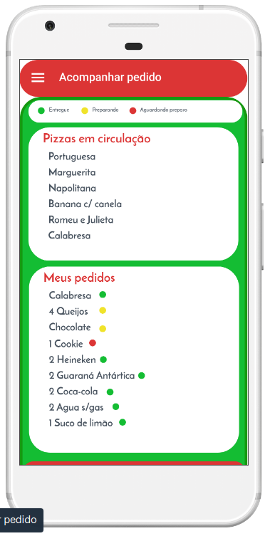
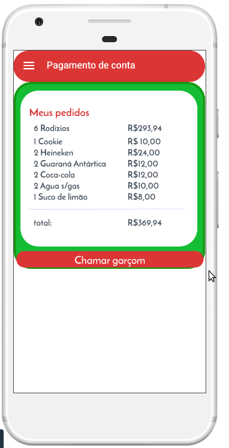
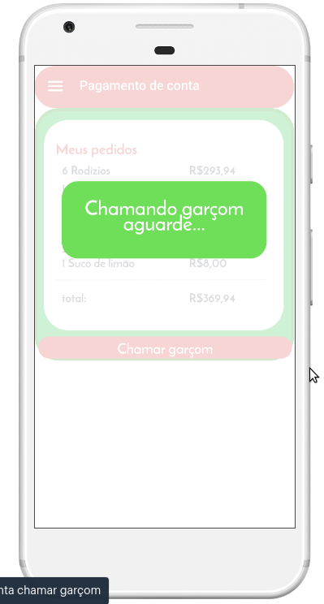

### Visão do funcionário

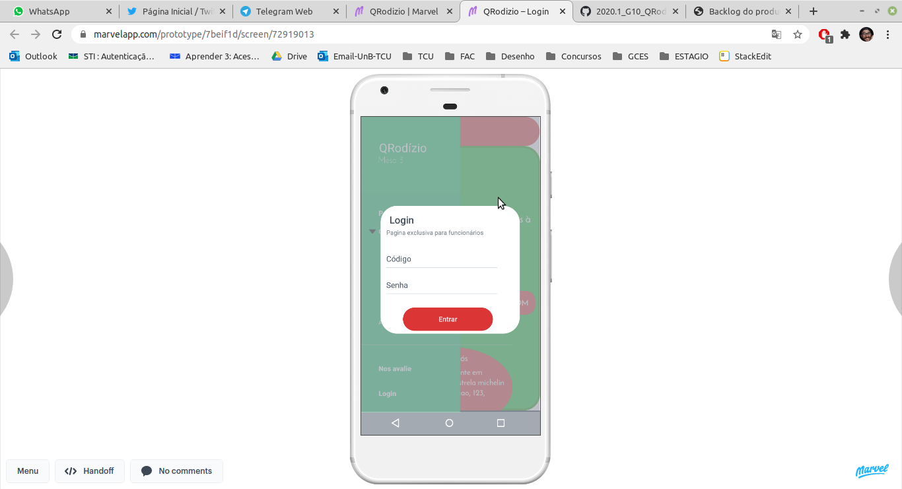
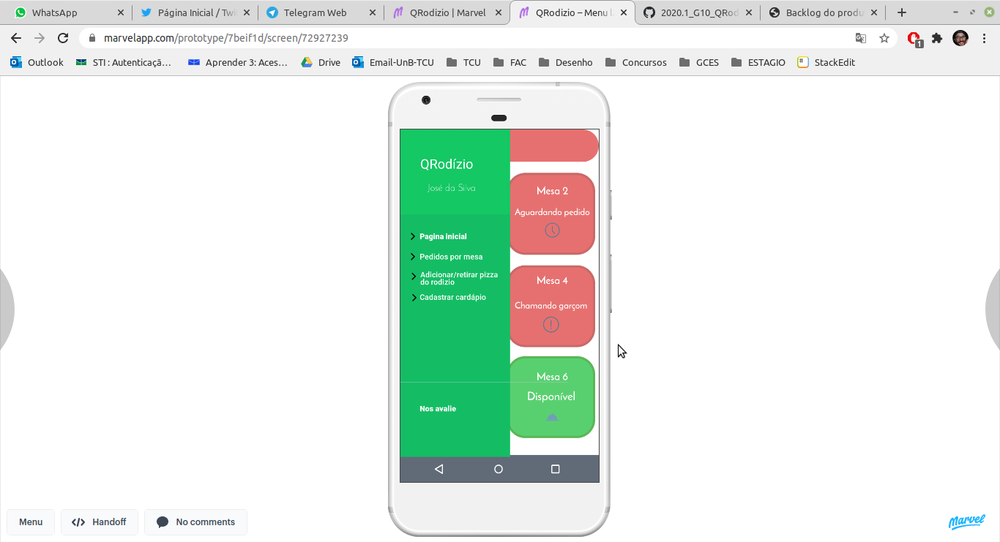

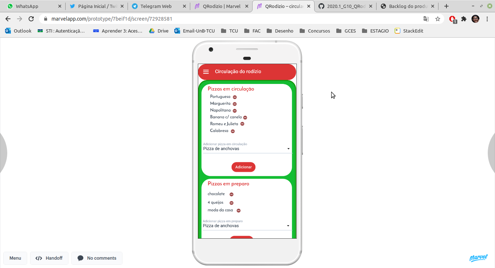

### Primeiro versão (descontinuada)

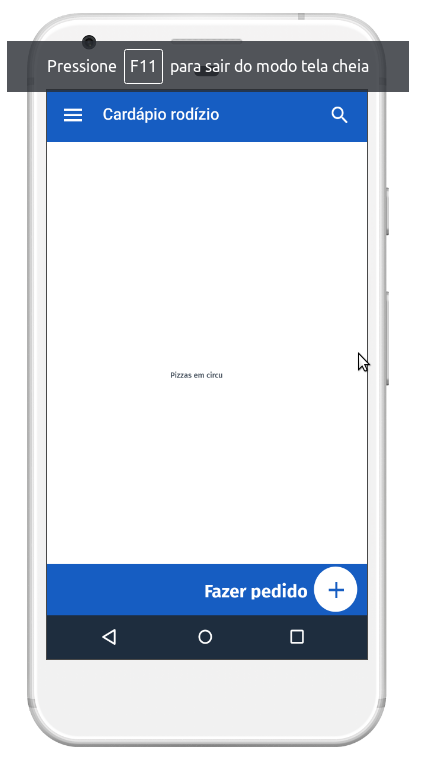
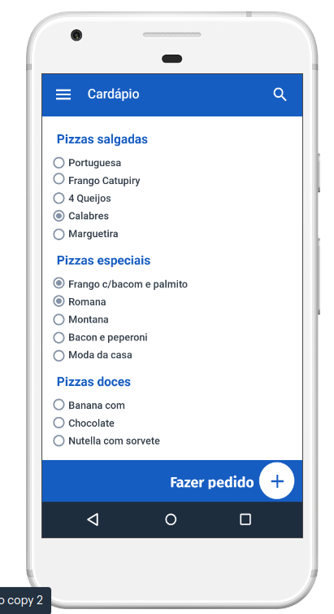
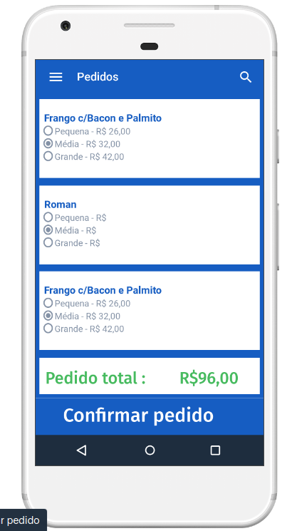

